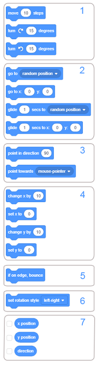

Апендикс
==========

.. include:: blocks.txt

.. include:: icons.txt

.. infonote::

  |intro11s|

Блокови функции
----------------

В Scratch формата на блок гарантира, че когато блоковете са свързани, те могат да формират само скриптове, които са синтактично правилни. Има независими блокове и функционални блокове. Независимите блокове (блокове с шапки, стекове, C-блокове и блокиращи блокове) съответстват на езиковите команди. Функционалните блокове (репортери и логически блокове) съхраняват стойности на независими блокове. В урок 3 говорихме за различните видове блокове и сега ще ви представим функциите на основните блокови групи и някои от групите, разположени в частта Разширения.

Блокове за движение
~~~~~~~~~~~~~~~~~~~

.. sidebar:: |motion_blocks| Motion
    
   |fig11_1|
 

    
   
Командите, присвоени на тези блокове, могат да се изпълняват само от спрайтове. Сцената е неподвижна, поради което не може да изпълнява команди за движение. В групата *Motion* има 18 блока, един повече, отколкото във версията Scratch 2.0. Блокът |glide_to| беше добавен.

За да ги улеснят, блоковете, които изпълняват подобни функции, стоят близо един до друг и образуват подгрупи. Функциите на подгрупите са следните:

1. преместване на спрайт по права линия или в кръг,

2. преместване на спрайт в определено положение,

3. насочване на спрайт към нещо,

4. преместване на спрайт чрез промяна на координатите му,

5. поддържане на спрайт в границите на сцената,

6. задаване на стил на въртене на спрайтовете,

7. съхраняване на текущите координати на спрайта.

Блоковете, принадлежащи към първите шест групи, са стекови блокове, докато седмата група представлява репортери, чиято функция е да съхраняват данни. Те не могат да стоят сами; те се вмъкват във входните полета на други блокове, като по този начин се уточняват техните действия.

Блоковете от първата група извършват относително движение, движение по отношение на текущото положение и посока. За разлика от тези блокове, тези от втората група преместват спрайта до определена точка на сцената, независимо от текущото й положение. Този тип движение се нарича абсолютно движение.

Няколко типа данни могат да бъдат въведени във входните полета на блокове за движение: стойности на координатите на дестинация, ъгъл на завъртане, брой стъпки или продължителност на движение. Една стъпка съответства на един пиксел. Времето се изразява в секунди, а ъглите в градуси.

В някои от блоковете дестинацията се избира от падащия списък на блока. Това може да бъде показалеца на мишката, някои други спрайтове, участващи в проекта, както и точка, чиито координати се генерират произволно.

Блокът |rotation_style| има три опции за стил на завъртане: *наоколо*, *наляво-надясно* и *не се върти*. Първият вариант означава, че спрайтът може да се изправи срещу всеки от 360 градуса. *Вляво-вдясно* означава, че спрайтът може да бъде обърнат само наляво или надясно, а всяка друга посока е деактивирана. Последната опция означава, че спрайтът винаги е изправен.

Блоковете от групата *Движение* са разработени в урок 2 от този урок.

.....

Бловове за Външност
~~~~~~~~~~~~~~~~~~~~

.. sidebar:: |looks_blocks| Looks
    
   |fig11_2|
 
.. |fig11_2| image:: ../_images/11/fig11_2.png

Блоковете от тази група контролират появата на спрайтове. Седем от 21 блока от тази група контролират появата на сцената.
Двадесет блока са видими, когато спрайт е във фокус, и три блокови подгрупи, когато етапът е във фокус. Блокът |switch_backdrop_wait|, който позволява фонът да се промени и да изчака, докато това се случи, може да се види само когато етапът е активен (не се вижда, когато спрайт е на фокус). Останалите блокове, които могат да бъдат прикрепени към сцената, също могат да се видят в този случай. Функциите на подгрупите са следните:

1. показване на това, което спрайт казва за мислене,

2. смяна на костюма на спрайта и фона на сцената,

3. промяна на размера на спрайт,

4. работа с графични ефекти, които могат да бъдат прикрепени към спрайтове и сцената,

5. показване или скриване на спрайт,

6. поставянето на спрайт в определения слой на изображението,

7. репортери, които показват текущия костюм и размера на спрайта, както и текущия фон на сцената.

Графичните ефекти, които могат да се добавят към спрайта, са:

.. hlist::
    :columns: 1

    * color - променя цвета на спрайта,
    * fisheye - създава впечатление, че спрайт се вижда през широкоъгълна леща,
    * whirl - усуква спрайта около централната му точка, 
    * pixelate - пикселира спрайта, 
    * mosaic - създава множество по-малки изображения на спрайта, 
    * brightness - променя яркостта на спрайта, и 
    * ghost - променя прозрачността на спрайта. 

Промяната на цвета например може да даде илюзията, че спрайтът изразява емоции или мига, може да изглежда, че се е появило съвсем ново нещо. Ако използвате промяна на цвета с командата `` печат``, можете да направите атрактивни шарки, например дъга.

Използвайки ефекта „fisheye“, можете да създадете илюзия, че спрайтът се движи към или извън екрана, става по-дебел и други подобни. Може да се използва като преход между костюмите.

Ефектът на вихъра може да символизира пътуване във времето, телепортация, световъртеж, гадене.

Ефектът на пикселиране прави спрайтите да изглеждат като при първите версии на компютърните игри, когато мониторите са с ниска разделителна способност; може да се използва и за цензура или блокиране на спрайта на сцената.

Мозаечният ефект се използва за размножаване на спрайтове без клониране.

Променяйки яркостта на спрайта, той може да създаде впечатление за светене или може да стане по-тъмен, а призрачният ефект може да направи спрайт невидим за потребителя, но други спрайтове все още могат да го засекат на сцената.

Блокове |goto_layer| и |go_layers| се различават от блоковете, изпълняващи подобни функции в предишната версия на Scratch.

Когато етапът е на фокус, можете да видите 8 блока, разделени на 3 подгрупи: за промяна на фона, за задаване на графични ефекти за фона и репортера, който показва текущия фон. Фонът ``Backdrop Name``, който съществуваше във версия Scratch 2.0, не е включен в новата версия.

Блоковете от групата *Изглежда* са разработени в урок 3 от този урок.

.....

Блокове за звук
~~~~~~~~~~~~~~~~~

.. sidebar:: |sound_blocks| Sound 
    
   |fig11_3|
 
.. |fig11_3| image:: ../_images/11/fig11_3.png

В проектите могат да се използват два вида звуци: звуци и ноти. Блоковете от тази група могат да се използват за работа със звуци, а блоковете от разширението *Music* за работа с ноти. Звуците са достъпни само чрез импортиране, запис или от вградена библиотека от звуци. Те се играят с помощта на звуковите блокове, които контролират силата на звука, темпото и др. Групата *Sound* е значително модифицирана в сравнение с това как е била организирана във версия Scratch 2.0. Някои от блоковете от тази група бяха преместени в разширението *Music*. Групата *Звук* има 9 блока, които са разделени на 3 подгрупи. Те могат да се прилагат както на спрайтове, така и на фона.

Функциите на подгрупите са следните:

1. пускане, спиране и възпроизвеждане на звуци,

2. прилагане на звукови ефекти,

3. контролиране на силата на звука.

**Стартиране, спиране и възпроизвеждане на звуци**

Блокът |play_until| възпроизвежда специфичен звук, спирайки скрипта, докато не приключи. За разлика от този блок, блокът |start_sound| възпроизвежда звук, без да спира паузата. Ето защо блокът "стартира звук" обикновено се използва за обявяване на действие, информиране на спрайт, че е постигната цел или подчертаване на определени събития.

От друга страна, блоковете "играят до" обикновено се използват за възпроизвеждане на "фонова музика". Този блок се поставя в блока ``завинаги`` и подходящата музика се възпроизвежда по време на цялото изпълнение на програмата. Може да се използва и за пауза на изпълнението на скрипта вместо на контролния блок ``изчакайте``.

Блокът "стоп звуци" ще спре всички звуци, които се изпълняват в момента - на всички спрайтове и на сцената. Например, ако проектът предлага опцията за музика, този блок се използва за изключване на музиката. Също така е обичайно всички звуци да бъдат спрени преди проектът да премине към следващата сцена и други подобни.

**Прилагане на звукови ефекти**

В Scratch 3.0 бяха въведени блокове, които задават и променят звукови ефекти. Въпреки че новият звуков редактор осигурява повече звукови ефекти (вижте по-долу в секцията за звуков редактор), блоковете поддържат само два: настройка и промяна на височината и преместване на аудио наляво или надясно.

**Контрол на звука**

Тези блокове засягат само спрайта (или фона), на който са присвоени. Например, щракването върху спрайт може да намали силата на звука, ако спрайтът става все по-малък, като по този начин изглежда като че ли спрайтът се отдалечава от потребителя. Освен това, ако се използват блокове от разширението *Music*, някои части от композицията може да се чуят по-силни, а други по-тихи.

Осем от тези блокове са стекови блокове, а един е репортерски блок, който съхранява информацията за силата на звука на звука.

.....

Блокове Събития
~~~~~~~~~~~~~~~~~~

.. sidebar:: |events_blocks| Events
    
   |fig11_4|
 
.. |fig11_4| image:: ../_images/11/fig11_4.png

Блоковете в тази група се използват за задействане на изпълнението на скрипта и изпращане и получаване на съобщения. В тази група има 9 блока и те са разделени на 3 подгрупи. Тъй като в тази версия на Scratch, видео сензорът е преместен в частта за разширения, той е премахнат от падащото меню на блока |when_greater|.

Функциите на подгрупите са следните:

1. задействане на скриптове със специфична дейност, извършвана от потребителя,

2. задействане на скриптове, когато конкретно условие е изпълнено по време на изпълнение на проекта,

3. даване на възможност за излъчване и получаване на съобщения.

** Задействане на скриптове с дейности, извършвани от потребителя **

Потребителят може да започне изпълнението на проекта, като натисне бутона |g_flag|, един от спрайтите, участващи в проекта, фона или чрез натискане на един от клавишните клавиши. Проектът обикновено се задейства при щракване върху зеления флаг, това е когато всички скриптове, които започват с този блок, ще бъдат активирани. Това са скриптове, които изпълняват различни инициализации и след това предават управлението на други скриптове. Например, те изтриват всички елементи от списъка, нулират променливите, задават сцени, като показват или скриват спрайтове и променят костюмите си, изтриват всичко нарисувано на сцената, пускат фоновата музика и др. Докато е напълно възможно да създавате проекти, без да използвате това блок, не се препоръчва. Единственият начин да се стартира проект, без да се използва този блок, е да се активират скриптове, които започват с някакъв друг блок от тази подгрупа. В този случай проектът ще продължи само докато не бъдат завършени скриптите, които зависят от първоначалните скриптове.

Забележка. Блокът |clicked_stage| се вижда само когато сцената е на фокус.

**Задействане на скриптове, когато конкретно условие е изпълнено по време на изпълнение на проекта**

Някои от събитията, които могат да задействат изпълнението на скриптове, започващи с един от блоковете от тази група, са промяна на фона, изтичане на определен период от време или увеличаване на силата на звука над определено ниво.

**Излъчване и получаване на съобщения**

Излъчването на съобщения е основният механизъм за координиране на поведението на спрайтите, участващи в даден проект, и може да се използва и за реализиране на процедури. Излъчването се използва за извикване на скриптове, които трябва да се активират, когато са изпълнени определени условия. Сценариите, които започват с блока |when_receive| ще бъде извикан, след като посоченото съобщение бъде излъчено. Ако същото съобщение се излъчва, докато скриптът все още работи, текущото изпълнение ще бъде спряно и скриптът ще започне да се изпълнява отново от началото. Следователно, ако поставим блока, който излъчва съобщението, на което скриптът отговаря, в скрипта, който започва с блока ``когато получи``, имаме ситуация, в която скриптът се обажда. Това се нарича **рекурсия** и може да се използва за създаване на фрактали, вечни контури и други подобни.

.....

Контролни Блокове
~~~~~~~~~~~~~~~~~~

.. sidebar:: |control_blocks| Control
    
   |fig11_5|
 
.. |fig11_5| image:: ../_images/11/fig11_5.png

Блоковете от тази група контролират изпълнението на скриптове. Те дават възможност за разклоняване, повторение и работа с спрайтови клонове и могат да спрат изпълнението на скриптове. Общо има 11 блока, един е начален (шапка) блок, два са блокове с капачки, три са блокове на стека, пет са С-блокове, а `` ако тогава друго '' е блок с форма на Е. Те са разделени на пет подгрупи, чиито функции са следните:

1. блок за чакане (пауза на скрипта),

2. блокове за повторение,

3. блокове с клони,

4. блок за условни повторения,

5. блок за спиране на скрипта,

6. блокове, използвани за работа с клонове.

Функциите на тези блокове са разяснени в уроци 5, 6 и 7 от този урок.

**Работа с клонинги**

Клонирането е функция, която позволява спрайтът да създаде копие от себе си, докато проектът работи. Всеки клонинг(копие) има същите костюми, звуци и сценарии като оригинала, но иначе е независим. Клонирането е различна форма на щамповане, защото клонингите са отделни спрайтове, които могат да изпълняват скриптове и да се държат според тези скриптове. Те се различават и от спрайтите, създадени с опцията за дублиране, тъй като обикновените дубликати са постоянни и се появяват в списъка с спрайтове, докато клонингите не, и те изчезват, когато проектът приключи.

Клонирането се използва винаги, когато проектът има подобни спрайтове, които правят подобни неща. Тъй като клонингите са направени от проекта, а не от потребителя, клонирането освобождава потребителя да не прави същите промени във всеки от многото спрайтове. Например, клонирането може да се използва за създаване на множество приятели и врагове спрайтове в игри, както и за специални ефекти като фойерверки и сняг.

Клоновете обикновено извършват действие, когато са създадени. Блокът |when_clone| задейства скрипта, който започва да се изпълнява, когато се създаде клонинга(копието). Множество скриптове, започващи с този блок, могат да бъдат добавени към един и същ спрайт и всички те ще се изпълняват едновременно, когато се създаде клонинга(копието). Самият скрипт може да работи на няколко клонинга(копието) наведнъж. Някои от действията, които този блок може да извърши, включват поставяне на клонинга(копието) в произволна позиция, преместване на клонинга(копието), докато той се сблъска с друг спрайт.

.....

Блокове за Сетива
~~~~~~~~~~~~~~~~~~~

.. sidebar:: |sensing_blocks| Sensing
    
   |fig11_6|
 
.. |fig11_6| image:: ../_images/11/fig11_6.png

Тази група е съставена от блокове, които позволяват на проекта да приема информация от различни устройства, подобно на това как човешките сетива събират информация от своята среда.
Има 18 блока в групата *Sensing*. Три блока, които бяха във версия Scratch 2.0 и които се отнасят за движение за редактиране на видео и наблюдение, регистрирани от видео, вече не са включени, но блокът |set_drag| беше добавен. Този блок регулира дали спрайт на цял екран може да се влачи или не, което беше предварително коригирано в информацията на спрайта. Блоковете, свързани с откриването на видеоклипове, са преместени в съответното разширение.

Тези блокове са разделени на 6 подгрупи със следните функции:

1. съхраняване на информация за разстоянието на спрайта спрямо показалеца на мишката или други обекти,

2. въвеждане на входни данни от клавиатурата,

3. съхраняване на информация за текущите операции на показалеца на мишката и клавиатурата,

4. съхраняване на текущата стойност на силата на звука,

5. работа с таймер,

6. запаметяване на параметри на спратите и сцената,

7. съхраняване на информация за текущото време и потребителя.

Само три блока от тази група могат да стоят самостоятелно, останалите са функционални блокове. Следователно блоковете от първата група се вмъкват в контролни блокове, които трябва да дават възможност за изпълнение на различни дейности в зависимост от позицията на спрайта. Блоковете от втората група съответстват на информацията, която човек събира с чувството на допир, а на третата група съответства на информацията, която се събира от чувството на слуха. Таймерът може да се използва за ограничаване на времето за игра в игра или времето, необходимо за изпълнение на тестова задача. Блокът, който съхранява параметрите на спрайтове и сцената, може да предостави много данни за всички обекти, които участват в проекта. Информация, която човек би събирал чрез зрението и компютър с видеокамера, може да се използва, ако разширението *Video Sensing* се добави към проекта.

Ние сме разработили функциите на повечето блокове в тази група чрез примерите в предишните уроци. Тук само ще споменем функциите на логически блокове и репортери за текущото време.

**Логически блокове**

В тази група има 5 логически блока. Всеки от тези блокове може да върне само една от две стойности: вярна или невярна, в зависимост от това дали условието е изпълнено или не. Логическите блокове се поставят във входните полета на шестоъгълната форма на контролните блокове.

**Текущо време и информация за потребителя**

Репортерският блок |time_unit| може да даде следната информация за текущото време.

.. image:: ../_images/11/fig11_6b.png
     :width: 200px   
     :align: center

.....

Блокове Оператори
~~~~~~~~~~~~~~~~~~~

.. sidebar:: |operator_blocks| Operators
    
   |fig11_7|
 
.. |fig11_7| image:: ../_images/11/fig11_7.png

В групата *Оператори* няма независими блокове, които биха отговаряли на езиковите команди. Всички блокове са функционални блокове, т.е. те съхраняват стойностите на число, низ или логически изрази и те се вмъкват в подходящи полета за въвеждане на независими блокове или други функционални блокове. Блокът |text_contains| е нов блок в тази група, който връща стойностите *true* или *false* в зависимост от това дали низът съдържа дадения символ или не.

В групата има 18 блока *Оператори* - 11 репортери и 7 логически (логически) блока, които позволяват следните видове операции:

1. основните аритметични операции - събиране, изваждане, умножение и деление,

2. генериране на произволни числа,

3. сравнения - по-голямо от, по-малко от, равно на,

4. изграждане на сложни логически изрази,

5. операции със струни,

6. цели числа,

7. изчисляване на стойността на математическите функции.

Основните аритметични операции могат да се извършват с цели и реални числа. Само делението на нула (делител = 0) може да доведе до проблеми, тъй като няма числа, които, умножени по нула, биха дали число, различно от нула (коефициент*делител = дивидент). Ето защо разделението по нула трябва да бъде предотвратено в програмите. Показахме как това може да се постигне в проекта *Млад математик* от урок 7 от този практикум.

В резултат на делението на нула, Scratch интерпретаторът връща една от стойностите *Infinity*, *NaN* (не число) или *-Infinity*, в зависимост от това дали дивидентът е положително число, нула или отрицателно число ,

Ние обяснихме използването на случайни числа, логически изрази и сложни логически изрази, образувани от логическите операции *и*, *или* и *не* с примерите, представени в предишните уроци.

Операциите, използвани с низовете, позволяват съединяването на два низа, като се избират символи, разположени в определени позиции в низа, се определя дължината на низа и се проверява дали низът съдържа указания символ. Операцията, извършена на струни, беше разяснена в урок 9 от този урок.
 
Целите операции, поддържани в Scratch, са изчисляването на остатъка в целочисленото деление и закръглянето на числата.

Математически функции, които могат да бъдат избрани от падащия списък на блока |function| са:

.. hlist::
    :columns: 6

    * abs
    * floor
    * ceiling
    * sqrt
    * sin
    * cos
    * tan
    * asin
    * acos
    * atan
    * e^
    * 10^ 

.....

Блокове за Променливи и Списъци
~~~~~~~~~~~~~~~~~~~~~~~~~~~~~~~~

.. sidebar:: |variables_blocks| Variables and Lists
    
   |fig11_8|
 
.. |fig11_8| image:: ../_images/11/fig11_8.png

Функциите на подгрупите са следните:

За променливи

1. репортери за променливите на потребителя,

2. настройване и промяна на стойността на променлива,

3. показване и скриване на променливи репортери на сцената.

За списъци

4. репортери за списъци с потребители,

5. добавяне на елементи в края на списъка,

6. операции, извършени в списъка,

7. информация за връщането на списъка,

8. показване и скриване на репортери от списъка на сцената.

Операциите, които се поддържат за работа със списъци, са:

.. hlist::
    :columns: 1

    * изтриване на елемент от определена позиция в списъка,
    * изтриване на всички елементи от определен списък,
    * вмъкване на елементи в списъка на дадени позиции, и  
    * замяна на артикули в определени позиции.

За списъка може да се получи следната информация:

.. hlist::
    :columns: 1

    * кой артикул е в посочената позиция, 
    * каква е позицията (в списъка) на посочения артикул, 
    * дължината на списъка (брой елементи в списъка) и 
    * дали елемент е включен в списък или не. 

Променливите и списъците могат да бъдат глобални - те могат да се използват от всички спрайтове или локални - могат да се използват само от един спрайт. Променливите и списъците, създадени за етапа, са видими за всички спрайтове.

Текущите стойности на променливите могат да бъдат проследявани на сцената чрез променливи монитори. Променливите монитори могат да са в три различни форми:

.. hlist::
    :columns: 1
    
    * показване на стойността с името на променливата,
    * голям дисплей на стойността без съответното име на променливата, 
    * дисплей, съдържащ плъзгача, която може да се използва за промяна на стойността на променливата.

Променливите са разработени в урок 7 и списъци в урок 9 от този урок.
 
.....

Моите блокове
~~~~~~~~~~~~~~~

.. sidebar:: |my_blocks| My blocks
    
   |fig11_9|
 
.. |fig11_9| image:: ../_images/11/fig11_9.png

Опцията за потребителя да направи свои собствени блокове и по този начин да приложи процедури, беше въведена за първи път във версия Scratch 2.0. В новата версия на Scratch цветът и формата на блоковете на потребителя бяха променени.

Определеният блок е първият блок, който ще се появи, когато потребителят поиска да въведе нов блок. Действията, които трябва да се извършват от този нововъведен блок, трябва да се добавят към дефиниращия блок. Тогава стек блок ще се появи в блоковата палитра с името, присвоено му в определението. Новият дефиниран от потребителя блок може допълнително да се използва като всеки друг блок.

Новият блок може да има полета за въвеждане. *Параметри* се вмъкват във полето за въвеждане на заглавието на дефиницията. Процедурите могат да имат повече от един параметър. Когато новият блок се използва за извикване на процедура, в полетата за въвеждане потребителят ще въведе *аргументи*. Аргументите заместват всеки вид на съответните параметри в процедурата.

Създаването и използването на въведените блокове са разяснени в урок 8 от този урок.

.....

Бокове на разширението Молив
~~~~~~~~~~~~~~~~~~~~~~~~~~~~~~~

.. sidebar:: |pen_extension| Pen
    
   |fig11_10|
 

В Scratch на всеки спрайт може да бъде определена позиция, посока и ориентация на движение и той може да остави отпечатък по време на движение. По този начин размерът, формата и цветът на спрайта не оказват влияние върху следата, оставена от спрайтовата рисунка с химикалка. Спрайтът може да бъде невидим или може да се състои от една точка, но това не влияе на неговата рисунка. Способността на спрайт да оставя отпечатък по време на движение се основава на блокове от тази група. Изображенията, които са създадени от спрайтове, се съхраняват като колекция от фигури, заедно с техните параметри. Изображенията, определени по този начин, се наричат ​​*векторна графика*.

Блоковете в разширението *Pen* са разделени на 5 подгрупи. Командата Shade pen от предишните версии е извадена и вместо да зададете цвета на писалката само по номер, цветът вече се определя от нюанс, наситеност и яркост. Всички блокове от тази група са стекови блокове.

Функциите на подгрупите са:

1. изтриване на всичко нарисувано (премахване на всички маркировки на писалката от сцената),

2. щамповане на спрайт,

3. поставяне на писалката нагоре или надолу,

4. настройка и промяна на атрибутите на писалката,

5. настройка и промяна на размера на писалката (дебелина).

Графичният редактор в тази версия на Scratch работи с така наречения цветен модел HSB (Hue, Saturation, Brightness). Това означава, че цветът е изграден с 3 компонента: нюанс, насищане и яркост. Цветовият нюанс показва цветното число в спектралната палитра, тоест самия цвят. Описва се в цветен кръг, в който ъгълът 0° представлява червения цвят (цветното число е нула), а ъгълът 180° представлява синьо-зеления цвят, наречен циан (цвят номер 100). Наситеността се отнася до интензивността на цвета - колкото по-голяма е наситеността, толкова по-чист е цветът. Наситеността може да бъде от 0 до 100%, като 0% интензитет представлява бял цвят и 100% интензитет чист цвят. Яркостта на цвета зависи от количеството на черния цвят, смесен с наблюдавания цвят.

.....

Блоковете от текст към реч и разширенията за превод
~~~~~~~~~~~~~~~~~~~~~~~~~~~~~~~~~~~~~~~~~~~~~~~~~~~~~~~~~~~~~~~~

.. sidebar:: |voices_extension| Text to Speech and |translate_extension| Translate
    
   |fig11_11|
 
.. |fig11_11| image:: ../_images/11/fig11_11.png

**Текст към Реч**

Това разширение може да се ползва само ако компютърът е свързан с Интернет |requires|, защото използва Amazon Web Services.

Когато избереш |voices_extension| от групата *Разширения*, в блоковата палитра ще се появят три нови блока. Те позволяват на спрайт да казва текста, вмъкнат във полето за въвеждане на първия блок, на езика, зададен от потребителя с третия блок от тази група. Потребителят може също така да зададе гласа, който всъщност ще говори текста: женски (сопрано или алто) или мъжки (тенор или бас). Това е зададено от друг блок от тази група.   

**Разширение превод**

Това разширение може да се ползва само ако компютърът е свързан с Интернет |requires|, защото използва Google. 

Когато избереш |translate_extension| от групата *Разширения*, в палитрата с блокове се появяват два нови блока. Те позволяват текстът, написан на един език, да бъде преведен на друг език. Блокът | език | показва кой език е зададен в Scratch. Текст, написан на текущия език в първото поле за въвеждане на блока | translate_to | се превежда на езика, избран от падащия списък на второто поле за въвеждане. Ако преводният блок е поставен във полето за въвеждане на блока ``казвам`` или ``мисля``, потребителят може да види превода.  

Използване на вградения графичен редактор
--------------------------------------------

Scratch има вграден редактор на цветове, който можете да използвате за създаване и промяна на спрайтове, костюми и фонове. Този редактор поддържа два различни режима на рисуване: растер (растерна карта) и вектор.

.. infonote:: 

  Компютрите могат да съхраняват изображения по два начина: растерни и векторни.
  
  В **растерна графика** изображението се съхранява като правоъгълна мрежа от пиксели - растерна карта. Растерното изображение се определя технически от ширината и височината на спрайта в пиксели и броя на битовете, необходими за съхраняване на цвета на пикселите. Например, ако имаме 16 цвята, са нужни 4 бита на пиксел за съхранение на цвета му. Растерната графика зависи от разделителната способност. Растерните изображения не могат да бъдат увеличени, без да се загуби качеството на изображението.
  
  Този недостатък се преодолява чрез прилагането на **векторната графика**, която съхранява изображение като съвкупност от фигури заедно с неговите данни (параметри), които определят как фигурата ще бъде нарисувана и къде ще бъде разположена. Графиката на костенурката е пример за векторната графика.
  
  Следващата фигура показва увеличено изображение на линия, нарисувана по тези два начина.

  .. image:: ../_images/11/fig11_12.png
     :width: 210px   
     :align: center

Потребителски Интерфейс
~~~~~~~~~~~~~~~~~~~~~~~

Следващата фигура показва оформлението на вградения редактор на цветове във векторен и растерен режим.

.. image:: ../_images/11/fig11_13.png
     :width: 1200px   
     :align: center

.. sidebar:: Нови Костюми
    
   |novi|
 
.. |novi| image:: ../_images/11/fig11_14.png

**Зона на костюмите**

Вляво е областта на костюма (1) с икони за всеки костюм и поредния номер на костюма. В долната част на областта на костюмите е бутон за създаване на нови костюми. За да редактирате различни костюми в редактора на бои, просто кликнете върху иконата на желания костюм и съответното изображение ще се появи в областта за редактиране - област за рисуване или платно (7).

Можете да добавите нов костюм (или фон), като задържите курсора на мишката върху бутона |b_sprite| разположен в долната част на тази област с показалеца на мишката и избиране на една от опциите, които ще се покажат. Можете да изберете костюм от библиотеката с костюми, да нарисувате свой собствен, да изтеглите файл с изображения от вашия компютър, да направите снимка или да изберете „костюм за изненада“, който е избран на случаен принцип от библиотеката с костюми.

Забележка. Библиотеката с костюми съдържа индивидуални костюми на всички спрайтове, намиращи се в библиотеката на спрайтове.

.. sidebar:: Промяна на режима на работа 
    
   |vector_bmp|
   
   |bmp_vector|
 

**Преобразуване на векторния режим в растерен режим и обратно**

Под долния ляв ъгъл на областта за рисуване е бутонът (2), който превключва редактора от един режим в друг. Инструментите, специфични за конкретния режим, могат да бъдат намерени в лявата част на екрана до зоната на рисуване, в нашата фигура векторният режим е маркиран с (5), а растерният (растерния) режим с (6). Опциите могат да се видят над зоната на рисуване (платното). Някои от тях са общи за двата режима на работа, на фигурата тези опции са рамкирани с червени правоъгълници (3), а някои от тях се отнасят само за векторния режим, като са рамкирани със сиви правоъгълници (4).

Общи опции
~~~~~~~~~~~~~~~

Тези опции са разположени над зоната на рисуване.

.. sidebar::  Смяна на цвета
    
   |promena_boje|
 
.. |promena_boje| image:: ../_images/11/fig11_15.png

|fill| **Смяна на цвета**

Щракването върху полето за въвеждане на блока, което се използва за задаване на цвета, ще отвори падащо меню, съдържащо плъзгачи: цвят, наситеност и яркост, а под тях инструмента пипета за вземане на проби от цвят. Можете да зададете желания цвят, като преместите плъзгача или щракнете върху инструмента очи.

Преместването на плъзгача *color* променя оттенъка на цвета (например, от червено до синьо). Този инструмент е най-често използваният, тъй като има най-голямата разлика между цветовете.
Придвижването на плъзгача *наситеност* променя интензитета на цвета: наситеността 100 е избраният цвят, 50 - по-светъл цвят, а 0 - е напълно бял.
Преместването на плъзгача *яркост* променя колко тъмен е цветът: яркостта 0 е напълно черна, докато 100 е избраният цвят.

Когато щракнете върху инструмента за очи, се появява лупа с кръг в центъра.
За да изберете желания цвят, трябва да позиционирате центъра на лупата над частта от зоната за рисуване, върху която е разположен този цвят, и щракнете върху.

Над трите плъзгача има четири опции. Те позволяват различни начини за запълване на зона с цвят. Дадена област може да бъде запълнена равномерно с плътен цвят или като градиент, с различни нюанси на цвят. Ако щракнете върху някоя от опциите, различни от опцията за плътен цвят, ще се появят два избрани цвята: |swap|. Като щракнете върху първия или втория цвят, можете да ги зададете. Кликването на *swap* между двата цвята променя реда им. Опциите за запълване са: плътен цвят, вертикален наклон, хоризонтален наклон или градиент на кръг.

|size| **Промяна размера на молива**

Има поле за въвеждане, за да изберете размера (дебелината) на писалката. Можете да въведете размера или да използвате стрелките отстрани, за да го промените. Колкото по-голям е броят, толкова по-дебела е линията.

|name| **Кръщаване на костюмите**

Името на костюма е важно за организацията, а понякога и за програмирането на проекта. Тъй като на всеки костюм е присвоен собствен пореден номер, не се препоръчва да назовавате костюмите, като използвате само номера, без други символи. За да назовете костюм, трябва да кликнете върху текстовата лента в горния ляв ъгъл на редактора на бои и да въведете новото име.

|copy| **Copying and** |paste| **Pasting** 

Вторият ред опции включва бутони за копиране и поставяне. Опцията за копиране копира избраната област, докато пастата я поставя някъде другаде. Можете също да използвате клавишните комбинации: Ctrl + C за копиране и Ctrl + V за поставяне. Първо изберете правоъгълната област, която искате да копирате и след това я плъзнете до мястото, където искате да поставите копието.

|redo| **Undo and Redo**

Вдясно до името на костюма има два бутона, наречени отмяна и повтор. Тези бутони ви позволяват да отмените последното действие или да повторите действието, което сте отменили преди това. Бутонът за повторение не може да се използва, ако не е използван бутон за отмяна. Ако излезете от редактора на бои, всичко, което сте направили в него, ще стане постоянно и може да се отмени само ръчно. Клавишната комбинация за опцията за отмяна е Ctrl + Z.

|flip_h| **Horizontal**  |flip_v| **and Vertical Flipping**

Когато изберете обект, има възможност да го завъртите хоризонтално или вертикално. Във втория ред от опции има два бутона с две стрелки, всеки насочен към пунктирна линия. Този отляво обръща избрания обект хоризонтално, а този отдясно вертикално.

Опции за векторния редактор
~~~~~~~~~~~~~~~~~~~~~~~~~~~~~~

Тези опции са достъпни само когато графичният редактор е във векторен режим и не се появяват, когато е в растерен.

**Прецизно движение на обекта**

Когато в векторния редактор е избран обект, клавишите със стрелки могат да се използват за преместването му точно по един пиксел. В растерния редактор, потребителят може да използва клавишите със стрелки, за да премества избрани области. Тази опция може да бъде полезна, ако искате да направите точен чертеж или да подравните различни обекти.

.. sidebar::  Промяна на контура
    
   |promena_konture|
 
.. |promena_konture| image:: ../_images/11/fig11_16.png

|outline| **Контури**

Вдясно от опцията, използвана за настройка на цвета, има падащо меню, което позволява на потребителя да променя очертанията на обектите. Това падащо меню има три плъзгача, но за разлика от менюто за настройка на цветовете, тук потребителят няма възможност да смеси два различни цвята. Вдясно до това падащо меню има поле за въвеждане, където потребителят може да избере дебелината на контура. Можете да въведете число или да използвате стрелките, за да го промените.

**Налагане на изображението**

Можем да използваме следната аналогия, за да обясним как са представени спрайтовете на сцената. Представете си, че всеки спрайт е нарисуван на отделен лист прозрачно фолио и че всички листове са подредени върху този, върху който е нарисуван фона. В Scratch тези прозрачни листове фолио отговарят на **слоеве**. Всеки път, когато спрайт се движи, той ще покрива изображенията, начертани на слоевете отдолу.

В горната дясна част на редактора на бои има четири бутона, които ви позволяват да местите обекти през различни слоеве:

.. hlist::
    :columns: 1
    
    * |v_forward| moves the object one layer forward (in front of the current one),
    * |v_front| moves the object all the way in front,
    * |v_backward| moves the object one layer backward (behind the current one),
    * |v_back| moves the object all the way back.

|v_group| **Групиране** |v_Ungroup| **и Разгрупиране**

Тази опция се използва за групиране на множество обекти в едно цяло. Когато има много обекти, които трябва да преместите наведнъж, може да бъде полезно да ги групирате. По този начин всички те могат да бъдат преместени или изтрити едновременно. За да изберете обекти, щракнете и плъзнете показалеца на мишката върху желаните обекти (или задръжте клавиша Shift на клавиатурата и щракнете върху всеки обект), след което щракнете върху опцията за групиране. От този момент нататък всички обекти ще бъдат третирани като един обект.

Опцията за разгрупиране прави обратното - избраната група може да бъде разбита на по-малки части. Този бутон ще стане видим, след като сте избрали група обекти и ще ви позволи да ги разгрупирате.

|v_curved| **Curved** |v_pointed| **or Pointed**

Когато използвате инструмента за преобразуване, вдясно от очертанията има две опции, които ви позволяват да направите шпонките или извити, като елипса, или заострени, като правоъгълник. Това е полезно, когато създавате форми с извити и заострени ръбове. Ако е избрана повече от една точка (задръжте клавиша Shift и кликнете върху повече от един), определената промяна ще бъде приложена към всички избрани точки.

Работа в растерен режим
~~~~~~~~~~~~~~~~~~~~~~~~~~~

.. sidebar:: Инструменти за растер

 |rasterski|

.. |rasterski| image:: ../_images/11/fig11_17.png
  
|r_brush| **Рисуване със свободна ръка**

Можете да зададете цвета и размера (дебелината) на четката за боя с подходящи опции. Използвайте опциите за отмяна и повторение, ако направите грешка. Можете също така да използвате гумата за коригиране на грешки.

|r_line| **Рисуване на права линия**

Можете да промените дебелината на линията с подходяща опция. Натиснете Shift и плъзнете, за да нарисувате хоризонтални или вертикални линии.

|r_circle| **Рисуване на елипса**

Можете да нарисувате куха (очертана) или пълна (с цвят) елипса. Натиснете Shift и плъзнете, за да нарисувате кръг. С подходящите опции можете да изберете стила на запълване и да промените дебелината на контура.

|r_rectan| **Рисуване на правоъгълник**

Можете да нарисувате кух (очертан) или запълнен (с цвят) правоъгълник. Натиснете Shift и плъзнете, за да нарисувате правоъгълник. С подходящите опции можете да изберете стила на запълване и да промените дебелината на контура.

.. sidebar:: Текст

 |tekst|

|r_text| **Писане на текст**

Щракнете навсякъде в областта за рисуване (платното) и когато се появи курсорът, напишете желания текст. След това щракнете извън текстовата област. Инструментът за избор автоматично избира текста, така че можете да промените неговия размер и ориентация. Можете да използвате полето за измерване, което се показва на външния ръб на полето за избор (кръгове и стрелки около текста), за да промените размера и да промените ориентацията на текста.

|r_fill|  **Запълване на затворени зони с цвят**
 
Можете да запълните областта равномерно с един цвят или като градиент, с нюанси на цветовете, като използвате подходящата опция за запълване.

|r_eraser| **Инструмент за изтриване**

Можете да зададете размера на гумата, като използвате подходящата опция. Изтритите области стават прозрачни.

|r_select| **Избор на правоъгълна зона**

Избраната област може да бъде:

1. плъзнете на ново място,

2. направени по-големи, направени по-малки или завъртени,

3. изтрива се с натискане на клавиша Del на клавиатурата.

Работа във векторен режим
~~~~~~~~~~~~~~~~~~~~~~~~~~~

.. sidebar:: Векторни инструменти

 |vektorski|

.. |vektorski| image:: ../_images/11/fig11_19.png

|v_select| **Избор на обект**

Този инструмент се използва за преместване, изтриване, оразмеряване и въртене на обекти. Когато щракнете върху обект, около него ще се появи рамка |izbor_objekta|, което показва, че обектът е избран.

.. |izbor_objekta| image:: ../_images/11/fig11_20.png

Ако искате да изберете няколко обекта наведнъж, щракнете върху левия бутон на мишката и плъзнете мишката върху желания обект или задръжте клавиша Shift и щракнете върху всеки обект, който искате да изберете едновременно.
Когато преместите курсора близо до центъра на обекта, той променя формата си и се превръща в ръка, което означава, че можете да местите обекта наоколо върху платното. Обектът може да се премества и с клавишите със стрелки на клавиатурата.
Избраният обект може да бъде изтрит чрез натискане на клавиша Del. Обектите могат да бъдат преоразмерени с полетата за измерване, които се появяват на външния ръб на полето за избор.
За да завъртите обект, хванете и плъзнете стрелките за въртене.

|v_reshape| **Промяна на формата на обект**

Щракнете върху обекта, който искате да прекроите и на периметъра на обекта ще се появи набор от контролни точки, както е показано на фигура (1). Кликнете върху една от контролните точки и плъзнете (2). С щракване върху контура на обекта можете да създадете други контролни точки (3). Можете да изтриете контролна точка, като приведете курсора към нея (4). Избраната точка ще промени цвета и след това трябва да кликнете върху нея (5). Бутоните |v_curved| и |v_pointed|, оито се появяват в опциите, ви позволяват да извиете или насочите контура на обекта.     

.. image:: ../_images/11/fig11_21.png
   :width: 680px   
   :align: center

|v_brush| **Рисуване със свободна ръка**

This tool is similar to the corresponding tool in raster mode. Hold the mouse cursor and move it to draw a curved line. Instead of pixels, the spline here is defined by a set of control points. You can change the appearance of the line with the tool *Reshape*.

|v_eraser| **Гумичка**

Този инструмент е подобен на съответния инструмент в растерен режим. 

|v_fill| **Запълване на затворени зони с цвят или оцветяване на контура на обект**

Инструментът за боядисване във векторен режим работи по различен начин, отколкото в растерния режим, където инструментът запълва всяка избрана затворена зона. Кофата за векторен режим работи само с векторни обекти. След като изберете този инструмент, можете да промените цвета или контура на даден обект, като щракнете върху него.

|v_text| **Писане на текст**

Кликнете върху инструмента и след това навсякъде върху платното; когато се появи курсор, започнете да пишете желания текст. След като приключите, щракнете навсякъде извън областта на текста. Инструментът *Select* автоматично ще избере текста, така че можете да промените неговия размер и ориентация. За разлика от текста в растерния режим, текстът, създаден във векторен режим, може да бъде редактиран по всяко време, дори и след излизане от редактора на боя. За да можете да променяте съдържанието му, трябва само да изберете текста.

|v_line| **Рисуване на права линия**

Линията се определя от две контролни точки в двата края. За да нарисувате линия, щракнете и задръжте мишката там, където искате линията да започне, и плъзнете, за да нарисувате линията до крайната точка. За да нарисувате хоризонтална или вертикална линия, задръжте клавиша Shift, докато влачите мишката.

За да начертаете извита линия, първо трябва да нарисувате права линия, след това изберете инструмента *Reshape*, натиснете Shift и щракнете където и да е на линията, за да създадете нова точка и след това плъзнете новата контролна точка. Това е начин за формиране на извита линия.

|v_circle| **Рисуване на елипса**

Използвайте този инструмент, ако искате да нарисувате елипса в избрания за рисуване цвят. Щракнете, за да маркирате горния ляв ъгъл, след което плъзнете (задръжте клавиша за смяна, докато рисувате с инструмента за елипса), докато получите желания размер. Можете да промените стила на запълване (запълнен или празен) и дебелината на линията, като използвате бутоните в областта с опции. Създадената елипса има 4 равномерно разположени контролни точки.

|v_rectan| **Рисуване на правоъгълник**

Използвайте този инструмент, ако искате да нарисувате правоъгълник в цвета, избран за рисуване. Кликнете, за да подчертаете горния ляв ъгъл, след това плъзнете (задръжте клавиша за смяна, докато рисувате с инструмента за правоъгълник), докато получите желания размер. Можете да промените стила на запълване (запълнен или празен) и дебелината на линията, като използвате бутоните в областта с опции. Създаденият правоъгълник има 4 контролни точки, по една от всеки край.

Използване на вградения звуков редактор
----------------------------------------

Звуковият редактор позволява на потребителите да редактират и ремиксират звуците. В музиката терминът *remix* се използва за обозначаване на нова, модифицирана версия на музикална композиция.

Потребителски интерфейс
~~~~~~~~~~~~~~~~~~~~~~~~~

Прозорецът за звуков редактор е разделен на две области: списък със звуци (1) и област за редактиране (2).

.. image:: ../_images/11/fig11_22.png
   :width: 880px   
   :align: center

.. sidebar:: Нов звук

 |novi_zvuk|

.. |novi_zvuk| image:: ../_images/11/fig11_23.png

**Списък със звуци**

Списъкът със звуци се намира в лявата част на прозореца и се използва за избор на звуци, които ще бъдат редактирани в областта за редактиране. Избирате звук, като щракнете върху него. Около иконата на избрания звук ще се появи дебел син контур, подобен на този около активния спрайт в списъка с спрайтове. В горния ляв ъгъл на активния спрайт се появява "x", което позволява изтриването му.

В долната част на областта има бутон |b_sound|, който дава възможност за въвеждане на нови звуци.

**Редактор** 

Областта за редактиране има лента отгоре (3), графично представяне на звук в средата (4) и лента отдолу (5), която съдържа 7 инструмента. 

В горната лента са инструментите, които редактират звука, но не добавят никакви ефекти. Това са:

.. hlist::
    :columns: 1
    
    * поле за име на звука,
    * бутон за връщане назад и напред,
    * бутон |trim|, който изтрива избрани части от звука.

В долната лента са инструментите, които правят специални ефекти, докато звукът се възпроизвежда:

.. hlist::
    :columns: 1

    * |faster| - по-бързо,
    * |slower| - по-бавно,
    * |echo| - ехо,
    * |robot| - робот,
    * |louder| - по-силно,
    * |softer| - по-меко и
    * |reverse| - наобратно. 
    
Увеличаването на звука по-бързо или по-бавно се постига чрез възпроизвеждане на по-високата или долната нота, вместо действителната. Ехо ефектът се постига чрез възпроизвеждане на звука след 0,15 секунди.

