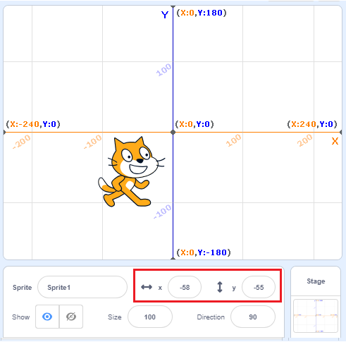
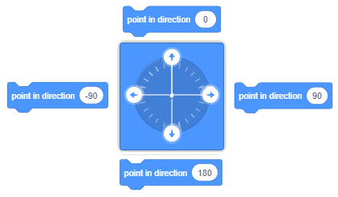
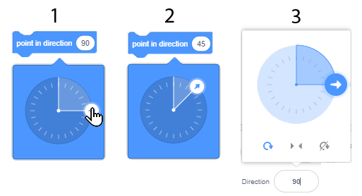
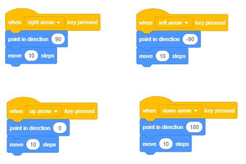
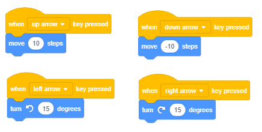
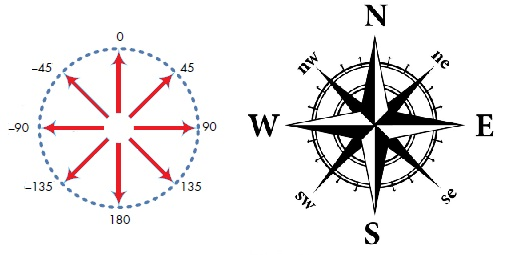
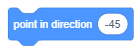

Кажете ми къде да отида - координати и посока
=================================================

.. include:: blocks.txt

.. include:: icons.txt

.. infonote::

  |intro2|

След като се запознаете с основите на среда, е време да научите как можете да изпратите спрайтовете си до желаното място на сценаа. За да направите това, трябва да знаете как е организиран сценаа и кои команди дават възможност за движение.

.. sidebar:: Sprite координати

 |stage|

.. topic:: Сцената
      
 Когато отворите Скрач, сцената се създава автоматично: бял правоъгълник с ширина 480 точки и височина 360 точки. Най-малката точка, която може да бъде показана на екрана на компютърна графика, се нарича *пиксел Pixel*.

 Сцената е мястото, където ще се изпълняват вашите истории, игри и анимации. Тя е неподвижна, като аквариум, но обитатели й- спрайтите винаги се движат и си взаимодействат помежду си. За да се контролират лесно движенията на спрайтовете, на всяко място на сценаа се назначава адрес - координати x и y, тези координати представляват разстоянието на това конкретно място от центъра на сцената. Точката, която е разположена в центъра на сцената, има координатите х = 0 и у = 0, или (0,0).

 Координатите ни позволяват точно да движим нашите спрайтове около сцената и да ги позиционираме навсякъде, където пожелаем (x, y). Текущата позиция на спрайт може да се види в информацията на активния спрайт.

.. topic:: Функции на блоковете за движение
 
 Всички команди, които позволяват позиционирането на спрайта на желаното място и контролират посоката и движението му, са разположени в групата от блокове, наречени Движение (Motion). В този урок ще научите повече за блоковете за движение и как да използвате *reporter blocks*, като разгледате примери и правите упражнения. Репортерските блокове не съответстват на езикови команди и не могат да стоят независимо в сценариите. Функцията на репортерски блок от групата Движение е да съхранява текущите координати и упътвания на спрайтовете.

.. topic:: Репортери на движението

 В тази група има |x_position| и |y_position| блокове, които съдържат текущата информация за позицията на спрайта (неговите x и y координати) и |direction| блока, който представлява посоката на спрайта.

 Ако искате да видите текущите координати и посоката на спрайта, трябва да кликнете върху квадратчето до желания блок. Ако кликнете върху квадратчетата до категории за движение, на сцената ще се появят дисплеи, с които можете да наблюдавате текущите координати и посоката на спрайта.

 .. image:: ../_images/2/fig2_2.png
   :width: 400px   
   :align: center
 
 
.. topic:: Абсолютно и относително движение

 Можете да изпратите своя спрайт до определено място на сцената по два различни начина : с абсолютно или относително движение.

 **Absolute Motion** се придвижва до определено място - дестинация, независимо от текущото положение на спрайта.

 В Скрач можете да изпратите спрайта си в дадена позиция (х, у) на сцената, тоест можете да извършвате абсолютно движение, като използвате следните блокове:

 - |goto_xy| - отидете на позиция (х,у),
 - |glide_xy| - плъзга се към позицията (х,у), 
 - |set_x| - задайте координата x към позицията, 
 - |set_y| - задайте координата y към позицията.

 Използвайки |goto_xy| блока, спрайтът ще се премести незабавно в дадената позиция (х,у).

 По същия начин целта ще бъде постигната с блока |glide_xy|, но преместването не би било моментално ; това би продължило определен брой секунди. Колкото по-голям е броят на дадените секунди, толкова по-дълго ще отнема спрайтът, за да достигне своята дестинация.

 Друг начин за задаване на дестинация в абсолютно движение е независимо да зададете координатите x и y, като използвате блоковете |set_x| и |set_y|.

 **Относителното движение** се придвижва до място, определено от броя стъпки, които спрайт ще направи от текущата позиция. Разбира се, вие също трябва да зададете посоката, в която трябва да се движи спрайтът (вдясно, нагоре и т.н.).

 Друг начин за задаване на дестинация в относително движение е независимо да се зададат координатите x и y, като се използват блоковете |change_x| и |change_y| blocks.

 В Скрач можете да изпратите спрайт до място, определено от броя стъпки от текущата му позиция, тоест можете да извършвате относително движение, като използвате следните блокове:

 - |change_x| - преместете определено количество пиксели хоризонтално спрямо текущата позиция, 
 - |change_y| - преместете определено количество пиксели вертикално спрямо текущата позиция (х, у), 
 - |turn_right| - завийте надясно определено количество градуси спрямо текущата посока, 
 - |turn_left| - завийте наляво определено количество градуси спрямо текущата посока, 
 - |move_steps| - премества определено количество стъпки в дадената посока спрямо текущата позиция.
    

.. sidebar::  Блокове за движение
   :subtitle: |point_direction| and |point_towards|

   Има три начина за задаване на стойност в полето за въвеждане на първия блок:

   |direction1|

   (1) да изберете една от предлаганите стойности от падащия списък, например (0) нагоре;
   (2) въведете нова стойност, вместо старата, например 45;
   (3) да завъртите синята стрелка, показваща посоката в текущата информация за спрайт.

   От падащото меню можете да изберете към кой обект ще бъде насочен спрайтът в другия блок.

   |direction2|

.. topic:: Посока и въртене

 В допълнение към блоковете на въртене |turn_right| и |turn_left|, които ви позволяват да промените посоката спрямо текущата посока на спрайта, в Скрач има опция за използване на блокове, които задават посоката, независимо от текущата позиция на Sprite.

 Това са блокове  |point_direction| и |point_towards|. 

 На следващата фигура можете да намерите основните стойности на посоката, които можете да зададете в полето за въвеждане на първия блок: *нагоре* (север), *надясно* (изток), *надолу* (юг) и *наляво* (запад).

 .. image:: ../_images/2/fig2_5.png
   :width: 250px   
   :align: center

 Можете да зададете и други стойности, например стойност 45 ще насочи спрайта в посока североизток, а 135 - на югоизток. За да го насочите на запад, не е необходимо да използвате отрицателни числа. Можете вместо това да въведете числа от 180 до 360.

Вторият блок насочва спрайта към курсора на мишката или към някакъв друг спрайт в проекта. Като кликнете върху белия триъгълник в полето със стойност, можете да отворите падащия списък и да изберете към кой обект искате да насочите спрайта. Например, в проекта „Разходка на динозавъра“, който ще бъде анализиран по-късно в този урок, котката може да бъде насочена към курсораа на мишката или към един от трите динозавъра, които представляват спрайтове в този проект.
  

|study| Изучете следните примери
----------------------------------

Тъй като показахме лесния начин да направим нашия спрайт разговор в нашия проект „Здравей свят“ и след това като правим упражнения, надградихме нашия проект, така че спрайтът наистина да произнася текста, сега ще покажем основните команди, които ще ни позволят да движим нашия спрайт, а след това ще ги надградим чрез различни упражнения.

Пример 1 - Проект „Разходката“
~~~~~~~~~~~~~~~~~~~~~~~~~~~~~~~~

|1| Кликнете върху блоковете Движение(Motion) след което плъзнете блока |move_steps| към зоната на сценариите и кликнете върху него. Котката ще се движи на 10 стъпки вдясно.

|2| Кликнете няколко пъти върху този блок и отведете котката до десния ръб на екрана. 

Кликването многократно върху блока за движение позволява действието, зададено от този блок, да се повтори няколко пъти. Повтарянето на определено действие може да се постигне и чрез кодиране.

|3| Върнете котката в средата на екрана и кликнете върху *Control* блокове. Различно оформените блокове от тези, които сте използвали, ще се появят в палитрата с блокове - C-образни блокове с „устни“, в които можете да вмъкнете други блокове.

|4| Изберете блока |forever| и го плъзнете в зоната за сценариите. Кликването върху този блок дава възможност на всички вмъкнати в него блокове да се движат постоянно (докато не спрете изпълнението на програмата, като кликнете върху знака *Stop*).

|5| Поставете блок за преместване в „зъбците“ на блока повторение завинаги и кликнете върху тях. 

Котката отново ще излезе извън екрана. Има начин да задържите движението на спрайта вътре в границите на екрана. Това би било използването на блока с командата, ако е на ръба, отскача. Този блок е разположен в *Движение*.

|6| Спрете изпълнението на блоковете, като кликнете върху знака за спиране и след това плъзнете блока |if_edge| към зоната на сценариите и го поставете в „зъбците“ на повторения *forever* блок под блока за преместване.

.. sidebar:: Сценарият на проекта

  Следният е добавен към спрайта за котки.

  |script|

.. |script| image:: ../_images/2/fig2_6.png

Изпълнявайки този променен сценарий, котката непрекъснато ще се движи от единия ръб до другия, но когато се движи вляво, ще бъде обърната по грешен начин. Разбира се, има начин да се поправи това. Единият е да промените начина, по който спрайтът се движи в спрайт информацията, а другият е да използвате един от блоковете на въртене.

|7| Плъзнете блока |rotation_style| от блоковете за Движение и го поставете над повторения блок завинаги. Уверете се, че левият десен режим на въртене е избран от падащия списък на този блок.

|8| Поставете |clicked_flag| блока в горната част на сценария и с това сте завършили проекта „Разходка“. 

Вече можете да стартирате проекта, като кликнете върху *зеления флаг* и да го спрете, като кликнете върху знака за *стоп*. Запазете проекта и продължете проучването.

.......

В следващия ни проект ще покажем как можете да въведете нови спрайтове и фонове и как да ръководите спрайт с помощта на курсора на мишката. Ето защо, преди да преминете към този пример, гледайте уроците *Добавяне на спрайт* и *Добавяне на фон*.

Пример 2 - „Разходката на динозавъра“
~~~~~~~~~~~~~~~~~~~~~~~~~~~~~~~~~~~~~~~~~

В предишния пример използвахме блока повторение завинаги, за да накараме спрайт-котката да се движи непрекъснато между краищата на екрана, докато спрем изпълнението на проекта, като кликнем върху знака за спиране. В този проект ще имаме четири спрайта и всеки от тях ще има свой собствен сценарий, който ще определи поведението им. Котката ще следва курсора на мишката посточнно, а останалите три спрайта - динозаврите, ще бъдат насочени към котката. Можете да видите как изглежда проектът в началото на картинката:

.. image:: ../_images/2/fig2_7.png
   :width: 490px   
   :align: center

**Създаване на проекта**

.. sidebar:: Избор на фон

  Можете да добавите нов фон към проекта, като кликнете върху иконата, разположена вдясно, до иконата *Изберете спрайт (Choose a sprite)*, която се използва за избор на нови спрайтове.

  |new_backdrop|

.. |new_backdrop| image:: ../_images/2/fig2_8.png

|1| Кликнете върху иконата за избор на фонове и изберете динозавърския фон от библиотеката.

|2| Изберете спрайтовете  *Dinosaur1*, *Dinosaur2* и *Dinosaur3* ит библиотеката.

|3| Поставете ги така, както са на фигурата по-горе. Трябва да промените посоката на Динозавъра2. Стойността на посоката по подразбиране за всички спрайтове е 90° ¬¬¬(те гледат вдясно), а въртенето е *All Around*. Всички тези настройки могат да бъдат променени в частта за Спрайт информация или чрез използване на подходящи блокове за формиране на сценариите, добавени към определен спрайт. В този проект ще използваме първата опция.

|4| В информационния прозорец Sprite задайте стила на въртене, както следва: Динозавър1 - не се върти, Динозавър2 - наляво / надясно, Динозавър3 - навсякъде.

|5| Към всички динозаври добавете един и същ сценарий, който ще им даде команда да сочат котката по време на целия проект. Те обаче ще се държат по различен начин, тъй като нямат същия стил на въртене в настройките си за спрайт.

|6| За спрайт котката трябва да зададете командите, които ще позволят да насочва към координатите на курсора на мишката, тоест да се движи през сцената по същия начин, по който потребителят движи мишката.

Сценариите *(или сценария)*, описващи поведението на динозаврите и котката, са представени на следната фигура.

.. image:: ../_images/2/fig2_9.png
   :width: 395px   
   :align: center
 
Стартирайте проекта и преместете мишката през сцената. Обърнете внимание, че динозаврите следят движенията му по различни начини.

.......

.. sidebar:: Избор на клавиш

  Клавишът на клавиатурата, който ще изпълни сценария, се избира, като кликнете върху белия триъгълник до името на клавиша (интервал) и след това изберете желания клавиш от падащия списък.

  |fig2_11|

.. |fig2_11| image:: ../_images/2/fig2_10.png

Пример 3 - „Линейно движение“ 
~~~~~~~~~~~~~~~~~~~~~~~~~~~~~~~~~~~~

Изучете урока *Use the Arrow Keys* и създайте проект, при който котката се води около сцената с клавиатурата. 

|1|   Добавете блока |clicked_key| към котката.

|2|   Изберете клавишната *стрелка надясно*.
 
|3|   Изберете блока |point_direction| от *Движение* и го свържете с предишния блок.

|4|	Изберете блока |move_steps| от *Движение* и го свържете с предишния блок.

|5|	Натиснете клавиша с дясна стрелка на клавиатурата си няколко пъти. Какво става?

|6|	Дублирайте този сценарий (натиснете с десния бутон върху първия блок и след това изберете *Дублиране*).

|7|	В новия сценарий заменете дясната стрелка с лявата стрелка, в точка на блок в посока, вместо на 90 изберете -90.

|8|	Натиснете левия клавиш със стрелка на клавиатурата си няколко пъти. Какво става?

|9|	По същия начин направете още два сценария : да насочите котката 10 стъпки нагоре чрез натискане на клавиша със стрелка нагоре или 10 стъпки надолу чрез натискане на клавиша със стрелка надолу.

.......

Пример 4 - „Движение със завой“
~~~~~~~~~~~~~~~~~~~~~~~~~~~~~~~~~~~

Ще създадем още един проект за движение на спрайтове с помощта на клавиатура, но с модифицирани функции на клавишите със стрелки. Ще премахнем блоковете за посока и ще се присъединим към левия клавиш със стрелка и клавиша със стрелка надясно с командите, които въртят спрайта на 15 градуса вляво или вдясно. Също така ще се присъединим към клавиша със стрелка нагоре и клавиша със стрелка надолу с блока, който се движи 10 стъпки, т.е. отидете -10 стъпки. Съответните сценариите ще имат следното оформление.

Стартирайте проекта и тествайте как можете да управлявате движението на спрайт.

|ask| Разбра ли?
-------------------------

Question 1
~~~~~~~~~~

.. level:: 1

.. mchoice:: stage1
   :answer_a: 1280 пиксела широка и 600 пиксела висока
   :answer_b: 800 пиксела широка и 600 пиксела висока
   :answer_c: 480 пиксела широка и 360 пиксела висока
   :answer_d: 360 пиксела широка и 480 пиксела висока
   :correct: c
   :feedback_a: 
   :feedback_b: 
   :feedback_c: Вярно.
   :feedback_d: 
   
   Какви са размерите на сцената?
   
Question 2
~~~~~~~~~~

.. level:: 1

.. mchoice:: stage2
   :answer_a: в горния ляв ъгъл на сцената
   :answer_b: в долния ляв ъгъл на сцената
   :answer_c: в центъра на сцената
   :answer_d: зависи от добавения фон
   :correct: c
   :feedback_a: 
   :feedback_b: 
   :feedback_c: Вярно.
   :feedback_d: 
   
   Къде е местоположението на точката с координатите (0,0)?
   
   
Question 3
~~~~~~~~~~

.. level:: 1

.. mchoice:: blocks1
   :answer_a: Сензор 
   :answer_b: Движение
   :answer_c: Контрол
   :answer_d: Външност
   :correct: b
   :feedback_a: 
   :feedback_b: Вярно.
   :feedback_c: 
   :feedback_d: 
   
   Към коя група блокове принадлежат блоковете за управление на позицията, посоката, завъртането и движението?
   

Question 4
~~~~~~~~~~

.. level:: 1

.. mchoice:: stage3
   :answer_a: да
   :answer_b: не
   :correct: b
   :feedback_a:  
   :feedback_b: Вярно.
   
    Може ли Сцената да управлява блоковете за Движение?

Question 5
~~~~~~~~~~

.. level:: 2

.. mchoice:: absolute_motion
   :multiple_answers:
   :answer_a: 
   :answer_b: 
   :answer_c: 
   :answer_d: 
   :correct: a, d
   :feedback_a: 
   :feedback_b: 
   :feedback_c: 
   :feedback_d: 

   Кои блокове позволяват абсолютно движение? (Посочете всички верни отговори)

   .. image:: ../_images/2/q2_5.png
      :width: 530px   
      :align: center

Question 6
~~~~~~~~~~

.. level:: 2

.. mchoice:: relative_motion
   :multiple_answers:
   :answer_a: 
   :answer_b: 
   :answer_c: 
   :answer_d: 
   :correct: b, d
   :feedback_a: 
   :feedback_b: 
   :feedback_c: 
   :feedback_d: 

   Кои блокове позволяват относително движение? (Посочете всички верни отговори)

   .. image:: ../_images/2/q2_6.png
      :width: 530px   
      :align: center

Question 7
~~~~~~~~~~

.. level:: 2

.. mchoice:: reporters
   :multiple_answers:
   :answer_a: 
   :answer_b: 
   :answer_c: 
   :answer_d: 
   :correct: b, c, d
   :feedback_a:  
   :feedback_b: 
   :feedback_c: 
   :feedback_d: 

    Кой от блоковете представлява репортери за движение? (Посочете всички верни отговори)

   .. image:: ../_images/2/q2_7.png
      :width: 310px   
      :align: center

Question 8
~~~~~~~~~~

.. level:: 3

.. mchoice:: compass
   :answer_a: Югоизток
   :answer_b: Югозапад
   :answer_c: Североизток
   :answer_d: Северозапад
   :correct: d
   :feedback_a: Показва 135-ов ъгъл.
   :feedback_b: Показва -135-ов ъгъл.
   :feedback_c: Показва 45-ов ъгъл.
   :feedback_d: Вярно.
   
   На коя страна на света ще погледне спрайтът, след като стартира от блок |2_8|?

Question 9
~~~~~~~~~~

.. level:: 1

На следващата фигура можете да видите сцена с пет различни точки.

.. image:: ../_images/2/q2_9.png
   :width: 300px   
   :align: center
      
.. mchoice:: coordinates1
   :answer_a: (-200,-40)
   :answer_b: (-200,40)
   :answer_c: (200,-40)
   :answer_d: (200,40)
   :correct: b
   :feedback_a:  
   :feedback_b: Вярно.
   :feedback_c: 
   :feedback_d: 
   
   Какви са координатите на точка A?
  
.. mchoice:: coordinates2
   :multiple_answers:
   :answer_a: Точка A
   :answer_b: Точка B
   :answer_c: Точка D
   :answer_d: Точка E
   :correct: b, d
   :feedback_a:  
   :feedback_b: 
   :feedback_c: 
   :feedback_d: 

   Кои точки имат отрицателна y координата? 
   (Посочете всички верни отговори)

.. dragndrop:: coordinates_various
   :feedback: Try again
   :match_1: A|||(-200,40)
   :match_2: B|||(-160,-60)
   :match_3: C|||(20,0)
   :match_4: D|||(100,120)
   :match_5: E|||(180,-80)
    
   Като плъзнете правоъгълниците, съединете точките с техните координати.

Question 10
~~~~~~~~~~~

.. level:: 2

На следващата фигура можете да видите Сцена с шест различни точки.

.. image:: ../_images/2/q2_10.png
   :width: 300px   
   :align: center
      

.. dragndrop:: coordinates_symmetrical
    :feedback: Try again
    :match_1: A|||(-160,80)
    :match_2: B|||(-160,-80)
    :match_3: C|||(160,-80)
    :match_4: D|||(80,0)
    :match_5: E|||(160,80)
    :match_6: F|||(0,80)
    
     Като плъзнете правоъгълниците, съединете точките с техните координати.

.. mchoice:: symmetry_х
   :answer_a: Точка А
   :answer_b: Точка В
   :answer_c: Точка С
   :answer_d: Точка D
   :correct: c
   :feedback_a: This should be the point which has the same x, and the opposite value of the y coordinate as the Point E. 
   :feedback_b: This should be the point which has the same x, and the opposite value of the y coordinate as the Point E.
   :feedback_c: Вярно.
   :feedback_d: This should be the point which has the same x, and the opposite value of the y coordinate as the Point E.
   
   Коя точка е симетрична на точка E по отношение на оста *x*?

.. mchoice:: symmetry_у
   :answer_a: Точка А
   :answer_b: Точка В
   :answer_c: Точка С
   :answer_d: Точка D
   :correct: a
   :feedback_a: Вярно.
   :feedback_b: This should be the point which has the opposite value of the x coordinate, and the same y coordinate as the Point E.
   :feedback_c: This should be the point which has the opposite value of the x coordinate, and the same y coordinate as the Point E.
   :feedback_d: This should be the point which has the opposite value of the x coordinate, and the same y coordinate as the Point E.
   
   Коя точка е симетрична на точка E по отношение на оста *y*?
 
.. mchoice:: symmetry2
   :multiple_answers:
   :answer_a: A и B
   :answer_b: A и C
   :answer_c: A и E
   :answer_d: D и F
   :correct: a, b, c
   :feedback_a: 
   :feedback_b: 
   :feedback_c: 
   :feedback_d: 

   Кои точки са на еднакво разстояние от оста *y*? (Посочете всички верните отговори)

|try| Опитайте!
---------------

Упражнение 1 - Проследяване на позицията на спрайта
~~~~~~~~~~~~~~~~~~~~~~~~~~~~~~~~~~~~~~~~~~~~~~~~~~~~~

.. level:: 1

.. infonote::

  |1| Плъзнете котката Спрайт в горния ляв ъгъл на сцената и след това проверете информацията за Спрайт, за да видите координатите на новата позиция.

  |2| След това го плъзнете в горния десен ъгъл на сцената и проверете отново координатите на позицията, където сте го оставили.

  |3| Повторете това, което току-що сте направили, като преместите Спрайт в долната част на сцената. В кои позиции на Сцената координатата х имаше отрицателната стойност и в коя координата y?

  |4| Импортирайте *Ябълката* Sprite от библиотеката. Синята рамка трябва да се появи около миниатюрата на новия спрайт в Списъка, което означава, че Спрайт е активен. Ако не, кликнете върху миниатюрата му в списъка.

  |5| Проверете позицията на променливите х и позицията у в долната част на групата Движение. Ябълка: x позиция и Ябълка: y монитори на позицията ще се появят на Сцената.

  |6| Сега плъзнете *Ябълката* в различни позиции на сцената и проследете как се променят координатите му, като погледнете мониторите.

.......

Упражнение 2 - Определяне на позицията на спрайта с помощта на абсолютните блокове за движение
~~~~~~~~~~~~~~~~~~~~~~~~~~~~~~~~~~~~~~~~~~~~~~~~~~~~~~~~~~~~~~~~~~~~~~~~~~~~~~~~~~~~~~~~~~~~~~

.. level:: 2

.. infonote::

  |1| Кликнете върху снимката до списъка. Синята кутия ще се появи около миниатюрата на сцената, което означава, че сцената е на фокус.

  |2| Кликнете върху иконата *Select a backdrop*, след което изберете *Xy-grid* backdrop от библиотеката.

  |3| Сега кликнете върху раздела *Код*, за да получите Палитрата вместо списъка с фонове.

  |4| В блоковете за движение ще видите съобщение *Избрана сцена: без блокове за движение*, което е разбираемо, тъй като Сцената, която сега е активна, не може да се движи.
  
  |5| Кликнете върху спрайт за котки в списъка със спрайтове. Когато около миниатюрата на спрайта се появи синя рамка, блоковете за движение ще се върнат.

  |6| Плъзнете блока |goto_xy| към зоната на сценариите и след това променете стойността от x на 120 и стойността на y на 100. 

  |7| Кликнете върху променения блок в зоната на сценариите. Какво става?

  |8| Плъзнете блока |glide_xy| към зоната на сценария, след което променете стойността на x на -120 и стойността на y на 100. Какво се случва, когато кликнете върху този блок?

  |9| Вижте къде можете да намерите спрайт, след като кликнете върху блока, в който преди сте променили стойностите за x и y. Например, къде ще бъде Спрайт, ако и двете координати са отрицателни, ако са извън сцената и т.н.?

........

Упражнение 3 - Абсолютно и относително движение
~~~~~~~~~~~~~~~~~~~~~~~~~~~~~~~~~~~~~~~~~~~~~~~~

.. level:: 3

.. infonote::

  Опитайте се да ръководите Спрайт от точка A до точка B, като използвате различни блокове *Движение*.
   
  |1| Задайте *Hy-grid* от фоновата библиотека като фон.

  |2| Изберете два нови спрайта от библиотеката - букви А и В (Блок-А и Блок-В).
  
  |3| Задайте буквата А в долния ляв ъгъл на сцената в положение (-200, -120) и буквата В в горния десен ъгъл в положение (200, 120). Най-прецизният начин да направите това е да добавите блока |goto_xy| към буквата A (плъзнете я в зоната на сценариите, докато буквата A е активна) и въведете съответните координати х и у, след което кликнете върху блока. Следвайте същите стъпки за буквата B.
  
  |4| Добавете |goto| към котката и изберете *Block-A* от падащия списък (който ще се появи, когато кликнете върху белия триъгълник в полето за избор). *Забележка* |goto| |!=| |goto_xy|. 
   
  |5| Кликнете на |goto| и котката ще бъде зад буквата A.
  
  |6| Кликнете на |goto_layer| от групата на блокове *Looks* и котката ще бъде пред буквата А.
  
  .. image:: ../_images/2/ex2_3.png
     :width: 220px   
     :align: center

  |7| Сега в блока |goto| изберете *Block-B*, и след това кликнете върху него. Котката веднага ще бъде пред буквата Б.

  |8| Добавете блока |glide_to| към котката и изберете Block-A от падащия списък, след което кликнете върху него. Котката ще се плъзга за 1 секунда към буквата А. **Забележка**. |glide_to| |!=| |glide_xy|. 
    
  |9| Опитайте по третия начин. Първо добавете блока |point_towards| към котката и от падащия списък изберете опцията, където котката сочи към спрайт Block-A. **Забележка**.  |point_towards| |!=| |point_direction|

  Кликнете върху блока |move_steps|, докато котката достигне буквата А.

.......

Упражнение 4 - Използване на ротационен стил и блоковете за насочване
~~~~~~~~~~~~~~~~~~~~~~~~~~~~~~~~~~~~~~~~~~~~~~~~~~~~~~~~~~~~~~~~~~~~~

.. level:: 2

.. infonote::

 Създайте проект, в който спратите ще се държат същото като спрайтите в проекта „Разходка на динозавъра“, но не правете промени в информационния прозорец на спрайт. Вместо това задайте стила на въртене и посоката със сценариите, добавени към спрайтовете. Запазете този проект под името „Динозавърска разходка 2“.

.......

Упражнение 5 - Добавяне на нови спрайтове към съществуващите проекти
~~~~~~~~~~~~~~~~~~~~~~~~~~~~~~~~~~~~~~~~~~~~~~~~~~~~~~~~~~~~~~~~~~~~

.. level:: 2

.. infonote::

 Използвайте проекта „Разходка“ за създаване на нов проект, в който ще въведете нов спрайт. Това може да бъде куче или мишка, които винаги трябва да сочат котката. Добавете фона по ваш избор. Добавете стила на завъртане към сценария, определящ поведението на този нов спрайт. Не правете никакви промени в сценария, добавен към котката. Запазете този проект под името „Разходка 2“.

|bug| Отстранете грешката!
--------------------------

Грешка 1
~~~~~~~~

Ученикът искаше да направи проста анимация на движението на котката, като промени костюма. Затова добави следния сценарий.  

.. image:: ../_images/2/bug2_1.png
    :width: 220px 
    :align: center

Нищо обаче не се случи. Какво е направил ученикът погрешно?

Грешка 2
~~~~~~~~

Ученикът искаше спрайтът му да стъпи между левия и десния ръб на Сцената. Затова вмъква *смени костюма*, *премести се с 10 стъпки* и *отскочи, когато достигнеш до ръба* в блок *forever*. Въпреки това  не харесва факта, че спрайтът е обърнат по грешен начин, когато се движи към левия ръб на сцената. Какво трябва да направи, за да се коригира това?

  
|book| Обобщение
-----------------

В този урок показахме как можем да определим точната позиция на точка на сцената, като разгледаме двете координати. Можем да изпращаме спрайтове до определена позиция на сцената, като използваме блоковете за абсолютно и относително движение. Абсолютното движение е преместването на спрайта до ново място на сцената - дестинация, независимо от предишната му позиция. От друга страна, относителното движение променя позицията на спрайта спрямо предишната му позиция на сцената. Сцената не може да изпълнява блокове за движение. Разглеждайки примери за проекти и изпълнявайки упражненията, научихме как можем да контролираме движението на нашите спрайтове, използвайки клавиатурата и мишката си.

**Scratch проекти**: 2Studio_

.. _2Studio: https://scratch.mit.edu/studios/25119440/

**Нови понятия**: пиксел, координатна система, координати, блокове за движение, репортери на движение, абсолютно движение, относително движение, посока, режим на въртене. 

**Scratch команди**: |motion_blocks| - |move_steps|, |turn_right|, |turn_left|, |point_direction|, |point_towards|, |goto_xy|, |goto|,  |glide_xy|, |glide_to|, |set_x|, |set_y|, |change_x|, |change_y|, |if_edge|, |rotation_style|, |x_position|, |y_position|, |direction|; 

|events_blocks| - |clicked_key|; |looks_blocks| - |*| |goto_layer|,  |*| |switch_costume|; |control_blocks| - |*| |forever|.

Note. Blocks marked with the |*| sign will be discussed in the lessons that follow.

|project| Създайте проекти
---------------------------

Проект 1 - „Двама играча“
~~~~~~~~~~~~~~~~~~~~~~~~~~~

Започнете нов проект, който ще наречете „Двама играчю“. Поставете два спрайта на сцената, един отляво, а другият отдясно. Задайте спрайтите да се насочват един към друг. Добавете сценариите, които ще им позволят да се движат напред-назад и да се въртят по посока и обратно на часовниковата стрелка.

Контролните клавиши за първия спрайт трябва да бъдат:

•	Стрелка нагоре - Спрайтът продължава напред по права линия,

•	Стрела надолу - Спрайтът се връща по права линия,

•	Стрелка вляво - Спрайтът се завърта обратно на часовниковата стрелка,

•	Стрелка надясно - Спрайтът завърта по посока на часовниковата стрелка.

Контролните клавиши за втория спрайт трябва да бъдат:

•	Ключ W - Спрайтът върви напред по права линия,

•	Ключ S - Спрайтът се връща по права линия,

•	Ключ А - Спрайтът се завърта обратно на часовниковата стрелка,

•	Ключ D - Спрайт се завърта по посока на часовниковата стрелка.
