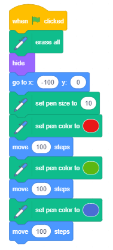

Да рисуваме - Графика на костенурка
====================================

.. include:: blocks.txt

.. include:: icons.txt

.. infonote::

 |intro4|

В предишните уроци научихме как можем да движим спрайта с помощта на мишката и клавиатурата си. Сега ще научим как можем да накараме нашия спрайт да остави отпечатък докато се движим. Ще използваме различни примери, за да изследваме функциите на блокове от групата, наречена Молив, които позволяват спрайтът да остави отпечатък на сцената, когато се движи. Този тип рисуване се нарича графика на костенурка. Освен това научихме как можем да синхронизираме поведението на нашите спрайтове, като добавим блокове за чакане към техните сценариите. В този урок ще покажем по-ефективен начин за това - синхронизиране на спрайтове чрез обмен на съобщения.  

.. topic:: Turtle Graphics

 Скрач е един от съвременните езици за програмиране, включващ графични варианти за костенурки, въведени за първи път на езика на *лого* преди около петдесет години.

 *Лого* даде възможност за управление на устройство за костенурка, тип робот, който беше свързан с компютъра. Костенурката можеше да се движи по хоризонтална повърхност напред и назад и да променя посоката и ориентацията си. Ако под костенурката се постави лист хартия, той може да остави отпечатък, като по този начин образува графика, наречена *графика на костенурката*.

 Този начин на задаване на изображение като съвкупност от фигури, заедно с техните данни (параметри), които определят как фигурата ще бъде нарисувана и къде ще бъде поставена, се нарича **векторна графика**.

 За разлика от векторната графика, в **растерна графика** изображението се съхранява като правоъгълна мрежа от пиксели - растерни. **Растерните изображения** се характеризират технически от ширината и височината на изображението в пиксели и броя на битовете, необходими за съхраняване на цвета на пикселите. Например, ако има само 16 цвята, се нуждаете от 4 бита на пиксел, за да запазите цвета. Растерната графика зависи от разделителната способност. Те не могат да бъдат увеличени без загуба на качество на изображението.

 В скрач всеки спрайт има възможност да се държи като Лого костенурката: можете да определите тяхната позиция, посока и ориентация на движение и те могат да оставят отпечатък, когато се движат. Размерът, формата и цветът на спрайта не влияят на маркировката, която оставят, защото спрайтите рисуват с молив. Спрайтът също може да бъде невидим или да се състои само от една точка и това не се отразява на рисуването му.
 
   

.. topic:: Функции на блоковете Молив

 Групата от блокове *Молив*, които позволяват на спратите да оставят отпечатък, когато се движат, т.е. да поддържат графиките на костенурките, са разположени сред разширенията.

 За да използвате блокове от тази група, трябва да:

 1.	Кликнете върху иконата |extensions| в долния ляв ъгъл на палитрата с блокове.

 2.	Изберете разширението за писалка от отворената галерия.

 3.	Иконата и блоковете ще се появят в палитрата с блокове.

  
 .. image:: ../_images/4/fig4_1.png
     :width: 740px   
     :align: center

 Групата *молив* включва следните блокове:
 
 .. hlist::
    :columns: 2

    * |erase_all| - изтрива всички следи, направени от молива
    * |stamp| - отпечатва образа на спрайта на сцената
    * |pen_up| - повдига молива нагоре
    * |pen_down| - поставя молива надолу
    * |set_color| - задава цвета на молива
    * |set_pen|- задава параметрите на чертежа
    * |change_pen| - променя параметрите на чертежа
    * |set_pen_size| - задава размера (дебелината) на молива
    * |change_pen_size| - променя размера (дебелината) на молива
    
 Ако добавите |pen_down| блока към спрайта си, от тогава нататък спрайтът ще оставя отпечатък на сцената всеки път, когато се движи. Когато добавите блока |pen_up| той ще спре да оставя знака, докато не добавите отново блока |pen_down|. Изгледът на марката се определя от параметрите на рисунката. Те включват размер (дебелина), цвят, наситеност, яркост и прозрачност на маркировката, оставена от молива. 
 
 Забележка. |erase_all| |!=| |hide|. Първият блок се отнася за рисунки, а вторият за спрайтове.

.. topic:: Използване на съобщения за синхронизация

 Поведението винаги се задейства от събитие, което може да бъде действие или получаване на съобщение. В предишните уроци и проекти използвахме блока ``wait``, когато искахме да синхронизираме поведението на нашите спрайтове. В проекта „Изчисляване“ ние позволихме на нашите момичета и момчета спрайтове да имат синхронизиран разговор - когато момичето говореше, момчето слушаше и обратно. 
 
 Сега ще покажем как действията на спрайтите (и сцената) могат да бъдат координирани, в зависимост от това дали се е случило събитие с излъчващо съобщение.
 Забелязахте, че не сме казали, че изпращаме съобщение, а че го излъчваме. Това е така, защото в скрач съобщението е насочено към всички обекти, а не само към един. Излъчването и получаването на съобщения в се постига със следните блокове, |broadcast|, |broadcast_wait| и |when_receive| в групата *Събития*.  

|study| Разучете следните примери
------------------------------------

Пример 1 - Проект „Рисуване на линия“ 
~~~~~~~~~~~~~~~~~~~~~~~~~~~~~~~~~~~~~~

Ще създадем проект, в който ще нарисуваме линия, която е широка 10 пиксела и дълга 300 пиксела. Ще изберем спрайта на Молив от библиотеката на спрайтове и ще изтрием котешкия спрайт. Тъй като искаме маркировката да бъде разположена по върха на спрайта с молив, ще преместим центъра на костюма на върха. Можем да направим това, като отворим раздела Костюм. Наличните инструменти ще се появят в лявата част на чертежа; в нашия случай това ще бъдат векторни инструменти, защото избрахме вектор спрайт (1). Използвайте |v_select|, за да изберете целия спрайт (2), след което плъзнете спрайта така, че върхът на молива е над центъра на знака, който показва центъра на екрана (3). 

.. image:: ../_images/4/fig4_2.png
   :width: 900px   
   :align: center

Първо, трябва да изтриете всичко, което преди това беше изтеглено с помощта на блока |erase_all| , поставете молива в начална позиция, от която ще започне да рисува, задайте цвета и размера на молив и след това използвайте блока за писалка надолу, за да оставете спрайта с молив да остави отпечатък, когато се движи. Трябва да добавите блока с писалка в края, за да спрете спрайтът да остави отпечатък в процеса на връщане в изходна позиция, всеки път, когато програмата се стартира. 

Има два начина да зададете цвета на молива:

- чрез блока |set_color|, където можете да изберете цвят, като кликнете върху полето за въвеждане

- чрез блока |set_pen|, където можете да изберете цвят, като поставите число във второто поле за въвеждане. 

В този проект ще използваме първата опция.

Кликвайки върху полето за въвеждане на блока за настройка на цвета на молив, отваряме падащото меню, където ще намерим плъзгачи с цветни компоненти: номер, прикрепен към цвета, наситеността и яркостта, а в долната част ще видим инструмент - пипета за събиране на цветни проби (1). Желаният цвят може да се зададе чрез преместване на плъзгачите или чрез кликване върху пипетата. Ако кликнете върху пипетата, ще се запали сцена с лупа, която има кръг в центъра (2). За да изберем цвят, трябва да поставим центъра на кръга над частта от сцената, където се намира този цвят, и след това да кликнем върху него. Ще получим същия резултат, както е показано на фигура (3).

Забележка. Можете да намерите повече информация за HSB цветовия режим, който използва компонентите: нюанс, наситеност и яркост, в частта *Appendix*.  

Резултатът от изпълнението на сценария и самия сценарий са представени на фигурата по-долу.

.. image:: ../_images/4/fig4_4.png
   :width: 470px   
   :align: center

......

Пример 2 - Проект „Рисуване със свободна ръка“ 
~~~~~~~~~~~~~~~~~~~~~~~~~~~~~~~~~~~~~~~~~~~~~~~~

.. level:: 1

Този проект трябва да илюстрира как използваме команди за рисуване и да покаже, че маркирането не зависи от размера на спрайта, нито от това дали спрайтът е видим или скрит. Молива прави рисунката, така че няма значение кой спрайт го държи. Този път ще изберем спрайта Kалинка1 от библиотеката на спрайтове.

Сценарийът, който се активира с кликване върху зеления флаг, позволява на калинката да следва курсораа на мишката за продължителността на бягането. В началото на сценария всички рисунки от предишното изпълнение на проекта ще бъдат изтрити от сцената и молив ще бъде повдигната. Командата ``pen up`` ще бъде добавена към *стрелката надолу*, когато е натиснат блок събитие, и командата писалка нагоре ще бъде добавена към стрелката нагоре, когато е натиснат блок събитие. По този начин ще се уверим, че спрайтът няма да остави следи, когато се движи, докато не натиснем клавиша със стрелка надолу. Спрайтът ще спре да оставя следи, когато натиснем бутона със *стрелка нагоре*.

Сценариите, добавени към калинката, са представени на фигурата по-долу. Чертежът ще бъде изпълнен по същия начин, дори ако блоковият скрийн беше поставен там, където е насочена червената стрелка във фигурата, но тогава спрайтът не би се виждал и изглежда, че рисунката се извършва от курсора на мишката.

.. image:: ../_images/4/fig4_5.png
   :width: 380px   
   :align: center

Разбира се, би било по-естествено, ако не трябваше да натискаме клавишите на клавиатурата, за да спускаме и повдигаме молива, а просто да рисуваме, докато държим натиснатия бутон на мишката, и след това спираме да рисуваме, като повдигаме пръста. Този тип рисуване се постига със следния сценарий. 

Ефектите от командата ``if then else`` ще бъдат разяснени в урок номер 6 на това ръководство. За сега нека кажем, че сценариът в този E-блок или ще изпълни командата |goto| и ``pen down`` командата от горния слот, или ``pen up`` от долния. Коя команда се изпълнява ще зависи от това дали бутонът на мишката е натиснат или не, което се определя от стойността, зададена в блока на мишката. Този блок принадлежи към групата Сетова и отчита дали стойността е вярна или невярна. Шестоъгълните **функционални блокове**, които отчитат само стойностите вярно или невярно, се наричат **логични блокове**.

.......

Пример 3 - Проект „Следвай моята следа“ 
~~~~~~~~~~~~~~~~~~~~~~~~~~~~~~~~~~~~~~~

.. level:: 1

В този проект движението на калинката се ръководи от използването на клавиши със стрелки, като в пример 3 от урока Координати на сцената. Маркировката, оставена от калинката, е прекъсната линия, направена от хоризонтални и вертикални линии. Следващата фигура включва проектните сценариите и външност на сцената след едно изпълнение на проекта.

.. image:: ../_images/4/fig4_7.png
   :width: 415px   
   :align: center

.. sidebar:: Цветово кодиране с числа

  Всяко цяло число от интервала [0,199] съответства на определен цвят. Например 0 е червено, 30 е жълто, 70 зелено, 130 синьо и 170 пурпурно. Номерирането на цветовете в Скрач се основава на реда на цветовете в спектъра. 

  |krug_boje|

.. |krug_boje| image:: ../_images/4/fig4_8.png

**Надграждане на проекта**

Ще променим проекта, така че спрайтът, който ще използваме за рисуване, да се движи по-свободно, като в пример 4 от урока „Координати на сцената“. Ще добавим настройката, която ще позволи цвета и размера на молива да се променят произволно на всеки 5 секунди, по този начин ще създадем по-атрактивен знак. За да зададем цвета на молив на случаен принцип, ще трябва да използваме различна команда спрямо тази, която използвахме в предишния пример. Този път ще използваме блока |set_pen|,където цветът е зададен от число. 

Следващата фигура представлява сценарий, който задава началните стойности и външния вид на сцената, след като модифицираният проект приключи да работи (сценарийът се активира чрез кликване върху зеления флаг). Блокът *repeat forever* съдържа команди, които задават цвета и размера на молив по „случаен“ начин.

.. image:: ../_images/4/fig4_9.png
   :width: 265px   
   :align: center

.......

Следващият пример показва как можем да нарисуваме различни стилове линии за подчертаване, като използваме командата за повторение, за да определим броя пъти, когато дадено действие се повтаря, което ще въведем в следващия урок. 

Пример 4 - Проект „Линии“
~~~~~~~~~~~~~~~~~~~~~~~~~~~~

.. level:: 2

В проекта **Линии** ще нарисуваме лилава линия с дължина 400 пиксела и ширина 2 пиксела, като се започне от точката (-200,0) в пет различни стила.

.. image:: ../_images/4/fig4_10.png
   :width: 150px   
   :align: center

Спрайтът, който рисува линията, е невидим. Той ще се появи в горния ляв ъгъл на сцената, само когато завърши начертаването на линията и ще каже как е нарисувана линията. 
Рисунката се активира от блок събитие |clicked_key|, сценариът за първия стил се активира чрез натискане на номер 1 на клавиатурата, вторият стил чрез натискане на 2 и т.н.

Кликването върху зеления флаг изтрива всичко, което преди е било на сцената, задава стойности за цвета и размера на молива, появява се спрайт и дава инструкции как да стартирате проекта.

Всеки от сценариите, свързани с клавиши 1-5 на клавиатурата, първо изтрива всичко, което преди това е било нарисувано на сцената, скрива спрайт, изчертава линията в дадения стил и след това показва спрайт в горния ляв ъгъл на сцената, което ни казва как е била начертана линията.

Първият стил е непрекъсната права линия. Това може да се направи веднага, като се даде само една команда „направи 400 стъпки“, но за да продължи това почти толкова дълго, колкото други сценариите, добавихме командата за повторение, така че спрайтът ще се движи 10 стъпки 40 пъти.

Вторият стил - спрайтът повтаря един и същ модел 100 пъти: той се движи 1 стъпка с молив надолу и 3 с молив нагоре.

Третият стил - спрайтът повтаря същия шаблон 50 пъти: той се движи 3 стъпки с молив надолу и, и 5 с молив нагоре.

Четвъртият стил - спрайтът повтаря същия шаблон 40 пъти: той се движи 6 стъпки с молив надолу и, и 4 с молив нагоре.

Петият стил - спрайтът повтаря същия шаблон 25 пъти: той се движи 6 стъпки с молив надолу и, и 4 с молив нагоре, 2 стъпки с молив надолу и 4 с молив нагоре.

На фигурата по-долу ще намерите сценариите за събитията при кликване на зеления флаг, когато е натиснат 1 клавиш и когато е натиснат 2 клавиша.

.. image:: ../_images/4/fig4_11.png
   :width: 470px   
   :align: center

Обърнете внимание, че командите за повторение не съкращават времето за работа на програмата, а само позволяват на програмиста да пише програми по-ясно и по-кратко.

.......

Пример 5 - Проект „Семейството“
~~~~~~~~~~~~~~~~~~~~~~~~~~~~~~~~~~

.. level:: 2

В този проект Пиленцето представя семейството си : майка кокошка, баща петел, брат и сестра. В началото виждаме само еднo пиленце, което кръстихме Лиза, а останалите спрайтове са скрити. Първо, Лиза представя майка си, Мардж. Когато каже името, майката ще се появи и излъчи, че е там. Тогава Лиза представя баща си Хоумър. Хоумър също се появява, когато „чуе“ името си и след това „отговаря“ със съобщение, съдържащо неговото име. Брат й Барт и сестра й Маги се представят на сцената по подобен начин. Синхронизирането на спрайт появяването и представянето се постига със съобщения. Когато Лиза представи някого, тя излъчва съобщението. Спрайтовете „слушат“ и когато получат съответното съобщение, те се появяват и излъчват съобщение с името си. Когато Лиза получава това съобщение - отговор, тя продължава с въвеждането на следващия член на семейството.

Следващата фигура показва как появата на спрайтовете се синхронизират със съобщения.

.. image:: ../_images/4/fig4_12.png
   :width: 600px   
   :align: center

**Приготвяне на спрайт**

.. sidebar:: Оформление на сцената
    
 .. image:: ../_images/4/fig4_13.png
   :width: 400px   
   :align: center
  
|1| За тази следваща презентация ще ви трябват следните герои: Лиза, Мардж, Хоумър, Барт и Маги. За Лиза, Барт и Маги ще използваме спрайта Пиленце, за мама ще използваме спрайта на Кокошка, а за татко ще използваме спрайта на Петела от библиотеката на спрайтове. След като добавите спрайтовете, променете имената им, така че да съответстват на нашия проект.

.. image:: ../_images/4/fig4_14.png
   :width: 400px   
   :align: center

|2| Изберете фона на *ферма* от фоновата библиотека.

|3| Поставете спрайта Лиза в средата в горната част на сцената.

|4| Поставете спрайта Марж в долната лява част и поставете Маги, която трябва да направите по-малка, до нея.

|5| Поставете спрайта на Хоумър в долната дясна част на сцената и го завъртете, така че да е обърнат наляво. Направете този на Барт по-голяма и го поставете между Маги и баща му и го завъртете, така че да е обърнат наляво.

Сценариите, добавени към спрайтовете, са представени на следващата фигура.

.. image:: ../_images/4/fig4_15.png
   :width: 850px   
   :align: center

|ask| Разбра ли?
-----------------

Въпрос 1
~~~~~~~~~~

.. level:: 1

.. mchoice:: turtle1
   :answer_a: да
   :answer_b: не
   :correct: b
   :feedback_a: Програмният език Лого е първият.
   :feedback_b: Правилно.
   
   Скрач е първият език за програмиране, който въвежда опциите за графика на костенурката.

Въпрос 2
~~~~~~~~~~

.. level:: 1

.. mchoice:: turtle2
   :answer_a: да
   :answer_b: не
   :correct: b
   :feedback_a: No, the first one refers to the drawings, and the second to the sprites.
   :feedback_b: Correct.

   Блокът за Изтриване ``erase all`` от групата *Молив* (*Pen*) има същата функция като блока за скриване ``hide`` от групата *Looks* (Външност). 
   
   
Въпрос 3
~~~~~~~~~~

.. level:: 1

.. mchoice:: turtle3
   :answer_a: да
   :answer_b: не
   :correct: a
   :feedback_a: Правилно. 
   :feedback_b: 
   
   Ако добавите блока ``pen down`` към сценарий на определен спрайт, той ще продължи да оставя отпечатък при движение.
   

Въпрос 4
~~~~~~~~~~

.. level:: 1

.. mchoice:: commands_pen1
   :multiple_answers:
   :answer_a: 
   :answer_b: 
   :answer_c: 
   :answer_d: 
   :correct: c,d
   :feedback_a: 
   :feedback_b: 
   :feedback_c: 
   :feedback_d: 

   Кои от блоковете принадлежат към групата *Молив*(*Pen*)? 
   (Изберете всички верни отговори)  

   .. image:: ../_images/4/q4_4.png
      :width: 600px   
      :align: center

Въпрос 5
~~~~~~~~~~
      
.. level:: 1

.. mchoice:: commands_pen2
   :multiple_answers:
   :answer_a: 
   :answer_b: 
   :answer_c: 
   :answer_d: 
   :correct: a,c
   :feedback_a: 
   :feedback_b:
   :feedback_c: 
   :feedback_d: 

   Всеки от тези блокове променя нещо. Кой ще промени маркировката, оставена от молив, докато рисувате ? 
   (Посочете всички верни отговори)
   
   .. image:: ../_images/4/q4_5.png
      :width: 705px   
      :align: center

Въпрос 6
~~~~~~~~~~

.. level:: 1

.. mchoice:: pen1
   :multiple_answers:
   :answer_a: блокът молив надолу не е активиран
   :answer_b: блокът молив нагоре не е активиран
   :answer_c: спрайтът е скрит
   :answer_d: блокът изтрий всичко е активиран
   :correct: a, b
   :feedback_a:  
   :feedback_b: 
   :feedback_c: 
   :feedback_d: 

   В някои програми спрайтът не оставя отпечатък при движение? Защо това се случва? 
   (Посочете всички верни отговори) 

   
Въпрос 7
~~~~~~~~~~
   
.. level:: 1

.. dragndrop:: pen2
    :feedback: Опитай пак!
    :match_1: hide|||Looks
    :match_2: erase all|||Pen
    :match_3: ask_and wait|||Sensing
    :match_4: point towards|||Motion
    
    Като плъзнете правоъгълниците, съберте блоковете с групите, към които принадлежат.

Въпрос 8
~~~~~~~~~~
   
.. level:: 2

.. dragndrop:: pen3
    :feedback: Опитай пак!
    :match_1: red|||0
    :match_2: yellow|||30
    :match_3: green|||70
    :match_4: blue|||130
    
    Всяко цяло число в интервала [0,199] съответства на цвят. 
    Като плъзнете правоъгълниците, групирайте цветовете с техния кодов номер.

|try| Опитай и ти!
-------------------

Упражнение 1
~~~~~~~~~~~~~

.. level:: 1

.. infonote::

  Какво рисуват следние програми?
 
  .. image:: ../_images/4/ex4_1.png
     :width: 390px   
     :align: center

.. reveal:: answer1
     :showtitle: Покажи отговора
     :hidetitle: Скрий отговора
 
     **Отговор:**

     .. image:: ../_images/4/ans4_1.png
        :width: 300px   
        :align: center

.......

Упражнение 2
~~~~~~~~~~~~~~~

.. level:: 2

.. infonote::

  Създайте сценарий, който ще даде възможност за следната рисунка.

  Преместете спрайта в положение (-50,30), сложете молив, след това добавете блокове, които позволяват следните относителни движения :

  1 |right|, 1 |down|, 2 |right|, 1 |up|, 1 |right|, 2 |down|, 4 |left|, 2 |up|.

  Пъвроначалното 5 |right| означава, че спрайтът трябва да се движи 10 стъпки надясно 5 пъти, а 1 |up|, че спрайтът трябва да се движи 10 стъпки нагоре 1 път. 
  За добавяне на команди за движение ще използваме и знаците |left| и |down|.

.......

Упражнение 3
~~~~~~~~~~~~~

.. level:: 2

.. infonote::

  Създайте сценарий, който ще използва само абсолютните команди за движение (и командите за писане надолу) за рисуване на същото изображение като в програмата за упражнения 2.

.......

Упражнение 4
~~~~~~~~~~~~~

.. level:: 2

.. infonote::
  
  *Графична диктовка 1**

  Това е първото от упражненията за *графична диктовка*. Първо, ще трябва да направите малко програмиране и да въведете много данни от клавиатурата. 
  По-късно този тип задачи ще изискват повече програмиране и много по-малко въвеждане на данни. 
  
  Създайте проект, който ви позволява да ръководите спрайт с клавишите със стрелки на клавиатурата си, като в пример 3 от този урок:

  - дясната стрелка премества спрайта 10 стъпки вдясно,

  - лявата стрелка движи спрайта 10 стъпки наляво,

  - стрелката нагоре движи спрайта 10 стъпки нагоре

  - стрелката надолу премества спрайта 10 стъпки надолу.

  Уверете се, че спрайтът е скрит и сцената е изчистена.

 
  Преместете спрайта в положение (-50,30), това ще бъде началната точка, сложете молив надолу, след което въведете следната серия стрелки:

  1 |right|, 1 |down|, 2 |right|, 1 |up|, 1 |right|, 2 |down|, 5 |right|, 2 |up|, 1 |left|, 1 |up|,

  2 |right|, 8 |down|, 1 |left|, 2 |up|, 1 |left|, 2 |down|, 1 |left|, 2 |up|, 3 |left|, 2 |down|,
  
  1 |left|, 2 |up|, 1 |left|, 2 |down|, 1 |left|, 3 |up|, 1 |left|, 4 |up|.

  Ако сте следвали добре инструкциите, трябва да се върнете към началната си точка. 
  
  Какво нарисувахте?

  .. reveal:: answer4
     :showtitle: Покажи отговора
     :hidetitle: Скрий отговора
 
     **Отговор:**

     .. image:: ../_images/4/ans4_4.png
        :width: 130px   
        :align: center

.. |left| unicode:: 0x2190
   
.. |up| unicode:: 0x2191

.. |right| unicode:: 0x2192

.. |down| unicode:: 0x2193

.........

Упражнение 5
~~~~~~~~~~~~~~

.. level:: 2

.. infonote::
  
 **Графична диктовка 2**

 Всички настройки от Графична диктовка 1 все още се прилагат, но алгоритъмът за рисуване е следният:

 Преместете спрайта до началната точка (-60,40), сложете молив и нарисувайте:

 3 |right|, 1 |up|, 1 |right|, 4 |down|, 6 |right|, 1 |up|, 1 |right|, 1 |down|, 1 |left|, 
  
 7 |down|, 1 |left|, 3 |up|, 5 |left|, 3 |down|, 1 |left|, 7 |up|, 3 |left|, 3 |up|.

 Ако сте следвали добре инструкциите, трябва да се върнете към началната си точка.
  
 Какво нарисувахте?

  .. reveal:: answer5
     :showtitle: Show the Answer
     :hidetitle: Hide the Answer
 
     **Отговор:**

     .. image:: ../_images/4/ans4_5.png
        :width: 135px   
        :align: center

|bug| Debug it!
---------------

Отстранете грешката!
~~~~~~~~~~~~~~~~~~~~

.. level:: 1

:Question:
   Ученикът е написал програма, която трябва да начертае линия с дължина 300 пиксела, където първите 100 пиксела са червени, вторите 100 пиксела са зелени, а последните 100 пиксела са сини.
 
   Когато изпълни сценария обаче, нищо не се случи. Какъв е проблемът?

.. reveal:: hiding21
   :showtitle: Покажи отговора
   :hidetitle: Скрий отговора
 
   **Отговор:**
     
   Блокът |pen_down| не беше добавен.

Bug 2
~~~~~~~~

.. level:: 1

:Question:
   Ученикът е написал програма, която трябва да нарисува синя линия с дължина 300 пиксела, където първите 100 пиксела са широки 10 пиксела, вторите 100 пиксела са широки 20 пиксела, а последните 100 са широки 30 пиксела. 
   Когато за първи път изпълни програмата всичко беше наред, но всеки път след това, когато той изпълняваше програмата, линията винаги беше широка 30 пиксела. Какъв е проблемът?

.. image:: ../_images/4/bug4_2.png
   :width: 205px   
   :align: center

.. reveal:: hiding22
   :showtitle: Покажи отговора
   :hidetitle: Скрий отговора
 
   **Отговор:**
     
   В края на първото изпълнение размерът на писалката е зададен на 30, писалката е разположена в края на реда на място (200,0) и не е нагоре.
   Следователно, когато програмата работи за втори път, писалката ще се върне в начална позиция с размер на писалката, зададена на 30 пиксела, така че ако тя изтегли над същия знак с по-малък размер на писалката, новата маркировка няма да бъде видима ,
   Грешката ще бъде поправена, ако писалката е повдигната нагоре, преди да се върне в първоначалното си положение.
 
   
Грешка 3
~~~~~~~~

.. level:: 2

:Въпрос:
   Ученикът е написал програма, която трябва да нарисува синя линия с дължина 300 пиксела, където първите 100 пиксела са широки 10 пиксела, вторите 100 пиксела са широки 20 пиксела, а последните 100 са широки 30 пиксела. Всеки път, когато той / тя изпълняваше програмата, следата беше една и съща, не с необходимите промени в размера, но много по-голяма. Какъв е проблемът? 
  
.. image:: ../_images/4/bug4_3.png
   :width: 205px   
   :align: center

.. reveal:: hiding23
   :showtitle: Show the Answer
   :hidetitle: Hide the Answer
 
   **Отговор:**
    
   Kомандата |change_pen_size| не трябва да се използва с параметри 20 и 30, но с увеличение на размера с 10 или вместо това да се използва командата |set_pen_size| с параметри 20 и 30.

  
|book| Обобщение
-----------------

В този урок ние представихме графиките на костенурките, които представляват пример за векторната графика. В Скрач всеки спрайт има Молив, с която може да рисува, докато се движи по сцената. Тази виртуална писалка има формата на кръгла четка и можем да променим нейния размер, цвят, наситеност, яркост и прозрачност. С различни примери и упражнения научихме как да използваме и свързваме блокове Движение и Молив, за да създаваме различни рисунки. Освен това научихме как да използваме команди за повторение, за да създаваме сценариите, които са по-кратки и по-ефективни. Командите за повторение ще бъдат допълнително разяснени в следващия урок. В последния пример показахме как можем да синхронизираме поведението на спрайтите, като разменяме съобщения. Механизмът за обмен на съобщения може да се използва и за реализиране на процедури, които ще бъдат обяснени в следващия урок.

**Scratch проекти**: 4Studio_

.. _4Studio: https://scratch.mit.edu/studios/25119442/

**Нови концепции**:  графика на костенурка, векторна и растерна графика, цветно кодиране, излъчване и получаване на съобщения.

**Scratch комади**: |pen_extension| - |erase_all|, |pen_up|, |pen_down|, |set_color|, |change_pen|, |set_pen|, |change_pen_size|,| |set_pen_size|; |sensing_blocks| - |*| |mouse_down|; 

|looks_blocks| - |hide|, |show|; |events_blocks| - |when_receive|, |broadcast|, |broadcast_wait|;

|control_blocks| - |*| |if_then_else|, |*| |repeat|.

Забележка. Блокове, маркирани със |*| ще бъдат обсъдени в следващите уроци.

|project| Създайте проекти
---------------------------

Проект 1 - „Светкавица“
~~~~~~~~~~~~~~~~~~~~~~~~~

Създайте проект, в който спрайтът на *Светкавицата* ще рисува с върха си. След като добавите спрайт от библиотеката, задайте центъра на костюма му да бъде отгоре. Добавете сценариите, които определят как трябва да се движи и задайте параметрите на рисунката.

Проект 2 - „Черно-бял свят“
~~~~~~~~~~~~~~~~~~~~~~~~~~~~~~~~~~~~

Създайте проект въз основа на проекта „Рисуване със свободна ръка“. Сцената трябва да има черен фон. Можете да направите фона черен, като използвате инструмента |r_fill| в растерния режим на редактора на бои, за да излеете черна боя върху желания фон. Спрайтът, който прави рисунката, трябва да бъде скрит, а цветът на молив да бъде бял. 

Проект 3 - „Моето семейство“
~~~~~~~~~~~~~~~~~~~~~~~~~~~~

.. level:: 2

Започнете нов проект, който ще наречете *Моето семейство*. Това трябва да бъде анимация, с която да се представят членовете на вашето семейство. За тази презентация ще са ви необходими следните спрайтове: водещ (вие), мама, татко, брат, сестра (в зависимост от действителните членове на вашето семейство). Използвайте снимки или изберете изображения на спрайтове, които ще представляват членовете на вашето семейство и ги персонализирайте, за да отговарят на проекта (направете ги по-малки или по-големи, подредете ги около сцената и ги завъртете, ако е необходимо). Всички спрайтове трябва да се скрият при кликване върху зеления флаг и да изчакат, докато се представят от водещия и след това да се появят на сцената в предварително зададена позиция. Синхронизирайте външния вид на спрайтовете, като използвате съобщения, както е показано в примера „Семейство“. Водещият е единственият спрайт, който се появява на сцената през цялото време. Той / тя първо ще каже името си и след това ще представи останалата част от семейството.
