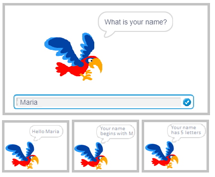

Низове 
=========

.. include:: blocks.txt

.. include:: icons.txt

.. infonote::

 |intro10|

В този урок ще покажем как стринг променливите могат да се използват за решаване на различни видове задачи. В същото време ще научим как Scratch съхранява низове и функции на блокове, използвани за работа с низове.

Низът представлява поредица от знаци, които се обработват с една единица данни. Струните имат широко приложение в програмирането. Можем да създаваме програми, които комбинират, сравняват, сортират, кодират и по друг начин обработват текст. Трябва да имате предвид, че числата също могат да бъдат третирани като низове, но в този случай ние не се занимаваме със стойности, които представляват, а със символи - цифри, от които се състоят.

.. topic:: Операции, изпълнявани на низове

 За да разберем по-добре тези операции, ще покажем резултата от всяка операция, извършена на низове s1=BANANA and s2=ANA. 
  
 В езиците за програмиране операциите, които най-често се изпълняват на низове, са следните:

 - определяне на дължината на низа
      ``length of s1`` → 6

 - сравняване на низове
      определяне кой е пръв по азбучен ред

      ``s1<s2 ?`` → false 

      това е невярно, защото „BANANA“ идва след „ANA“ по азбучен ред,

 - свързващи (съединяващи) низове 
      ``join s1 and s2`` →BАNАNААNА,

 - избор на знак, заемащ определена позиция в текста
      ``letter 3 of s1`` → N,

 - съдържа?
      проверява дали низът s1 съдържа низа s2

      ``s2 in s1 ?`` → true 

      това е вярно, защото "BANANA" съдържа "ANA",

 - позиция 
      определяне на първата позиция в низа, която съдържа втория низ

      pos(s1,s2): ``position s2 in s1`` → 2,

 - копиране 
      създаване на нов низ от даден брой знаци d, започващ от дадена позиция p в началния низ

      copy(s,p,d): ``copy from s1 characters 4 starting from 3`` → NАNА,

 - изтриване
      промяна на низ s1 чрез поставяне на низ s2 в низа s1, като се започне от дадената позиция p в началния низ

      delete(s1,p,d): ``delete from s1 characters 3 starting from 4`` → BАNА,

 -  вмъкване
      промяна на низ s1 чрез поставяне на низ s2 в низа s1, като се започне от дадената позиция p

      insert(s1,s2,p): ``insert s2 into s1 starting from 3`` → BААNАNАNА.

 Последните четири не са вградени операции в Scratch. В примера „Низови операции“ обаче ще покажем как можем сами да ги реализираме.

  
|study| Разучете следните примери
----------------------------------------

Пример 1 - Проект "Папагал"
~~~~~~~~~~~~~~~~~~~~~~~~~~~~

.. level:: 1

Основният спрайт в този проект е папагал. Първо, папагалът пита потребителя неговото име и след това изчаква потребителя да напише името си и натиснете * Enter * или кликнете върху отметката, разположена в десния ъгъл на полето за отговор. Тогава папагалът поздравява потребителя с името си и казва какво е първата буква на името и колко букви има в името. Разговорът между спрайта и потребителя е представен на фигурата по-долу.

За да създадем този проект, използвахме операции, които избират първата буква от името и определят колко букви са в името.

След изпълнение на командата |ask_wait|, Scratch съхранява серията от символи, въведени от потребителя, в пространството, наречено |answer|.

Следващата фигура показва как се съхранява отговорът, кои операции се използват за извличане на информация, излъчвана от спрайта, като изходни данни с командата ``say``.

.. image:: ../_images/10/fig10_2.png
   :width: 600px   
   :align: center

Третата операция, използвана за съставяне на изходното съобщение, е |join|.

Сценарият на проекта *Parrot* е представен на фигурата по-долу.

.. image:: ../_images/10/fig10_3.png
   :width: 475px   
   :align: center

Следващият проект ще ви покаже как можете да използвате стринг операции за извличане на конкретни цифри, които формират числа.

.......

Пример 2 - Проект "Обменни цифри"
~~~~~~~~~~~~~~~~~~~~~~~~~~~~~~~~~~~~~

.. level:: 2

**Сценарий на проекта**

Основната част на този проект е скрипт, който обменя първата цифра и третата цифра в трицифрено естествено число *x*, въведено през входа.

Презентаторът, който е основният спрайт в този проект, моли потребителя да въведе трицифрено число. Програмата проверява дали е въведен трицифрен номер. Ако не, заявката ще се повтаря, докато не бъде въведено трицифрено число. След това се извличат първата и третата цифра и новата *обърнат* номер се формира там, където са разменени първата и третата цифра. Този нов номер се създава с помощта на две операции |join|.
В крайна сметка водещият излъчва оригинала и новосформираното число.

Сценарият на проекта е представен на следната фигура.

.. image:: ../_images/10/fig10_4.png
   :width: 645px   
   :align: center

.......

Следващият проект проверява дали въведената дума е палиндром. Палиндром е дума или фраза, която чете същото отляво надясно и отдясно на ляво. Например, думата "мадам" е палиндром. Подобно е определено число, което е палиндром. Например 12321 е палиндром.

Пример 3 - Проект "Палиндром"
~~~~~~~~~~~~~~~~~~~~~~~~~~~~~~~~

.. level:: 3

Презентаторът моли потребителя да въведе дума. Променливата *d* получава дължината на думата като стойност. Програмата сравнява първата с последната буква, втората с предпоследната и така нататък до средата на думата. Променливата *i*, чиято първоначална стойност е 0 и която се увеличава с 1 в цикъла, позволява тези сравнения да се извършват със следната проверка.

.. image:: ../_images/10/fig10_5.png
   :width: 485px   
   :align: center

Променливата *p* показва броя на проверките. Ако една от проверките установи, че буквите, които се сравняват, не са еднакви, думата не е палиндром и това ще бъде регистрирано чрез присвояване на 0 на променливата *pal* (която е зададена на 1 в началото) ,
След като програмата направи проверка на всички двойки букви, тя ще напише съобщение, в което се казва дали думата е палиндром или не (*pal* = 1 да, в противен случай не).

Скриптът за проекта *Палиндром* е представен на следната фигура.

.. image:: ../_images/10/fig10_6.png
   :width: 495px   
   :align: center

.......

Пример 4 - Проект "„Низови операции"
~~~~~~~~~~~~~~~~~~~~~~~~~~~~~~~~~~~~~~~

В този проект потребителят е помолен да избере една от операциите: *копиране* или *изтриване*. Въвеждането се изисква в зависимост от това какво е било избрано и след това се изписва резултатът от операцията. Операцията се задава чрез натискане на съответния бутон, който след това излъчва операцията. Когато бъде получено съобщението, идентифициращо избраната операция, ще се изпълни скриптът, който изпълнява дадената операция.
В проекта участват два спрайта: бутон *Копиране* за създаване на копия и *Изтриване* за изтриване. Скриптът, който извършва изтриване, е малко по-опростен. Въз основа на въведените стойности за броя знаци и позициите, от които са взети, се създава нов низ s2. Този низ е празен в началото и се установява чрез добавяне на един знак наведнъж от дадена част от началния низ.

.. image:: ../_images/10/fig10_7.png
   :width: 330px   
   :align: center
   
Сценариите, добавени към разпискатана съобщението *Копие* са представени на следната фигура. Въвеждането на данни и формирането на изходното съобщение се представят като отделни процедури. Тези процедури могат да се използват и когато се поиска опцията *Delete*.
 
.. image:: ../_images/10/fig10_8.png
   :width: 680px   
   :align: center
   

Скриптът за изтриване прави обратното - той формира низ от частите, разположени пред и зад маркираните знаци. Също така започва с празен низ. Първо, той записва знаци от частта отпред, които са последвани от символи от частта отзад.

|ask| Отговори на следните въпроси
-------------------------------------

Въпрос 1
~~~~~~~~~~~

.. level:: 1

.. mchoice:: string1
   :answer_a: да
   :answer_b: не
   :correct: a
   :feedback_a: Вярно. 
   :feedback_b: 
   
    Може ли низ да съдържа знаци за аритметични операции?

Въпрос 2
~~~~~~~~~~~

.. level:: 1

.. mchoice:: string2
   :answer_a: L
   :answer_b: Е
   :answer_c: N
   :answer_d: А
   :correct: b
   :feedback_a: Това е буква 1.
   :feedback_b: Вярно.
   :feedback_c: Това е буква 3.
   :feedback_d: Това е буква 4.
   
   Какъв ще бъде резултатът от операцията ``letter 2 of LENA``?

Въпрос 3
~~~~~~~~~~~

.. level:: 1

.. mchoice:: string3
   :answer_a: да 
   :answer_b: не 
   :correct: b
   :feedback_a:  
   :feedback_b: Вярно.
   
     Низът ще каже ли същото по време на изпълнение на командите A и B?

Въпрос 4
~~~~~~~~~~~

.. level:: 1

.. mchoice:: string4
   :answer_a: L
   :answer_b: LENA
   :answer_c: 4
   :answer_d: Дължината на LENA
   :correct: c
   :feedback_a: Това ще бъде постигнато с писмото за операция от.
   :feedback_b: 
   :feedback_c: Вярно.
   :feedback_d: Това ще бъде постигнато чрез присъединяване на тези две думи.
   
    Какъв ще бъде резултатът от операцията  ``length of LENA``?

Въпрос 5
~~~~~~~~~~~

.. level:: 1

.. mchoice:: string5
   :answer_a: BАNА
   :answer_b: BАNАNА
   :answer_c: NАBАNА
   :answer_d: NАNАBА
   :correct: b
   :feedback_a: 
   :feedback_b: Вярно.
   :feedback_c: 
   :feedback_d: 
   
   Какъв ще бъде резултатът от операцията ``join BA and NANA``? 

Въпрос 6
~~~~~~~~~~~

.. image:: ../_images/10/q10_6.png
   :width: 680px   
   :align: center

.. dragndrop:: string6
    :feedback: Try again
    :match_1: A|||A
    :match_2: B|||nothing returns
    :match_3: C|||1
    :match_4: D|||7
       
    Чрез плъзгане свържете командите със стойностите за връщане.
   

|try| Опитай!
--------------

Упражнение 1 
~~~~~~~~~~~~~~
.. level:: 2

.. infonote::

  Създайте програма, която ще формира число от същите цифри, както в естественото число **n**, но го подреди в обратен ред.

.......      

Упражнение 2
~~~~~~~~~~~~~~~
.. level:: 2

.. infonote::

  Напишете програма, която определя сумата от цифрите и броя на цифрите за естественото число ** n ** (1 <= n <1000). Например:
   
  - n = 12 сумата на цифрите 3, а броят на цифрите е 2;

  - n = 102 сумата на цифрите 3, а броят на цифрите е 3.

.......

Упражнение 3
~~~~~~~~~~~~~~~

.. level:: 3

.. infonote::

  Напишете програма, която ще направи списък на всички трицифрени номера на Армстронг. Числото се счита за число на Армстронг, ако е равно на сумата от кубовете на неговите цифри.

    
|book| Обобщение
----------------------

 В този урок ние представихме типа данни, наречен низ и най-често срещаните операции, извършвани върху този тип данни. Чрез примерите на проекта показахме как променливите на низа могат да се използват за решаване на различни типове проблеми и как да се работи с низови операции, които са вградени в Scratch.

**Примери за проекти**: 10Studio_

.. _10Studio: https://scratch.mit.edu/studios/25119486/

**Нови концепци**: низ, палиндром.

**Нови команди**: |operator_blocks| - |text_contains|, |letter|, |length_text|.

|project| Създай проект
-------------------------------------------

Проект 1 - "Кодиране"
~~~~~~~~~~~~~~~~~~~~~~~~~

.. level:: 3

Създайте проект, който кодира и декодира въведения текст по следния начин.

Списъкът „оригинал“ съхранява 26 букви от азбуката в редовен ред. Списъкът "код" съхранява 26 букви в произволен ред, различен от този в списъка "оригинал". За да се затрудни процесът на декодиране, ако има гласна в някаква позиция в един от списъците, в другия списък също трябва да има гласна в същата позиция.
Потребителят въвежда текста, който проектът трябва да кодира и декодира в зависимост от това дали потребителят е натиснал бутона „кодиране“ или „декодиране“.

Например, ако буквите в списъците "оригинал" и "код" са в следните реда:

= = = = = = = = = = = = = = = = = = = = = = = = = = 

A B C D E F G H I J K L M N O P Q R S T U V W X Y Z

V U B G D Q X Y Z E Ј K L O М N А W P R S Т F H C I

= = = = = = = = = = = = = = = = = = = = = = = = = = 

и потребителят въведе текст MASK, програмата ще го кодира като LVPJ.

Ако обаче входният текст MASK трябва да бъде декодиран, програмата ще го превърне в ОQUL.

Проект 2 - „Назад“
~~~~~~~~~~~~~~~~~~~~~~

.. level:: 3

Създайте проект, при който потребителят е помолен да въведе колко думи иска да трансформира (n), след което въвежда име в цикъла, което ще бъде повторено n брой пъти, името се въвежда в списъка "имена" и след това се трансформира в низ, получен, когато името се чете от дясно на ляво, след което ще бъде въведено в списъка "назад".

Например, ако потребителят въведе n = 3 и след това име: LENA, MARIO, KATARINA; списъкът "назад" трябва да съдържа:
ANEL, OIRAM и ANIRATAK.

Проект 3 - "Числа"
~~~~~~~~~~~~~~~~~~~~~~

.. level:: 3

Създайте проект, който прави списък на всички трицифрени числа, който може да бъде разделен на числото, получено при изваждането на средната цифра.

